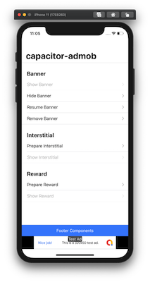
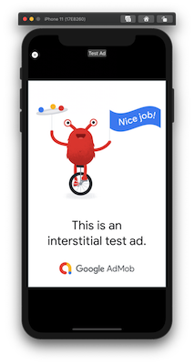
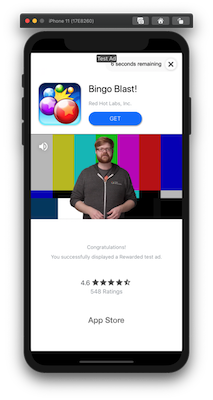
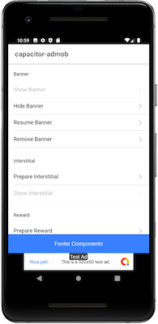
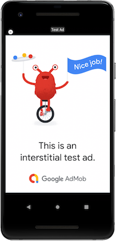

<p align="center"><br></p>
<h3 align="center">AdMob</h3>
<p align="center"><strong><code>@capacitor-community/admob</code></strong></p>
<p align="center">
  Capacitor community plugin for native AdMob.
</p>

<p align="center">
  
  <a href="https://www.npmjs.com/package/@capacitor-community/admob"></a>
<br>
  <a href="https://www.npmjs.com/package/@capacitor-community/admob"></a>
  <a href="https://www.npmjs.com/package/@capacitor-community/admob"></a>
</p>

## Maintainers

| Maintainer          | GitHub                                           | Social                                          | Sponsoring Company                             |
| ------------------- | ------------------------------------------------ | ----------------------------------------------- | ---------------------------------------------- |
| Masahiko Sakakibara | [rdlabo](https://github.com/rdlabo)              | [@rdlabo](https://twitter.com/rdlabo)           | RELATION DESIGN LABO, GENERAL INC. ASSOCIATION |
| Saninn Salas Diaz   | [Saninn Salas Diaz](https://github.com/distante) | [@SaninnSalas](https://twitter.com/SaninnSalas) |                                                |

Maintenance Status: Actively Maintained

## Contributors ✨

<a href="https://github.com/capacitor-community/admob/graphs/contributors">
  
</a>

Made with [contributors-img](https://contrib.rocks).

## Demo

[Demo code is here.](https://github.com/capacitor-community/admob/tree/master/demo)

### Screenshots

|             |                Banner                |                Interstitial                |                Reward                |
| :---------- | :----------------------------------: | :----------------------------------------: | :----------------------------------: |
| **iOS**     |  |  |  |
| **Android** |   |   |   |

## Installation

If you use capacitor 6:

```
% npm install --save @capacitor-community/admob@6
% npx cap update
```

### Android configuration

In file `android/app/src/main/AndroidManifest.xml`, add the following XML elements under `<manifest><application>` :

```xml
<meta-data
 android:name="com.google.android.gms.ads.APPLICATION_ID"
 android:value="@string/admob_app_id"/>
```

In file `android/app/src/main/res/values/strings.xml` add the following lines :

```xml
<string name="admob_app_id">[APP_ID]</string>
```

Don't forget to replace `[APP_ID]` by your AdMob application Id.

#### Variables

This plugin will use the following project variables (defined in your app's `variables.gradle` file):

- `playServicesAdsVersion` version of `com.google.android.gms:play-services-ads` (default: `23.0.0`)
- `androidxCoreKTXVersion`: version of `androidx.core:core-ktx` (default: `1.13.0`)

### iOS configuration

Add the following in the `ios/App/App/info.plist` file inside of the outermost `<dict>`:

```xml
<key>GADIsAdManagerApp</key>
<true/>
<key>GADApplicationIdentifier</key>
<string>[APP_ID]</string>
<key>SKAdNetworkItems</key>
<array>
  <dict>
    <key>SKAdNetworkIdentifier</key>
    <string>cstr6suwn9.skadnetwork</string>
  </dict>
</array>
<key>NSUserTrackingUsageDescription</key>
<string>[Why you use NSUserTracking. ex: This identifier will be used to deliver personalized ads to you.]</string>
```

Don't forget to replace `[APP_ID]` by your AdMob application Id.

## Example

### Initialize AdMob

```ts
import { AdMob } from '@capacitor-community/admob';

export async function initialize(): Promise<void> {
  await AdMob.initialize();

  const [trackingInfo, consentInfo] = await Promise.all([
    AdMob.trackingAuthorizationStatus(),
    AdMob.requestConsentInfo(),
  ]);

  if (trackingInfo.status === 'notDetermined') {
    /**
     * If you want to explain TrackingAuthorization before showing the iOS dialog,
     * you can show the modal here.
     * ex)
     * const modal = await this.modalCtrl.create({
     *   component: RequestTrackingPage,
     * });
     * await modal.present();
     * await modal.onDidDismiss();  // Wait for close modal
     **/

    await AdMob.requestTrackingAuthorization();
  }

  const authorizationStatus = await AdMob.trackingAuthorizationStatus();
  if (
    authorizationStatus.status === 'authorized' &&
    consentInfo.isConsentFormAvailable &&
    consentInfo.status === AdmobConsentStatus.REQUIRED
  ) {
    await AdMob.showConsentForm();
  }
}
```

Send an array of device Ids in `testingDevices` to use production like ads on your specified devices -> https://developers.google.com/admob/android/test-ads#enable_test_devices

### User Message Platform (UMP)

To use UMP, you must [create your GDPR messages](https://support.google.com/admob/answer/10113207?hl=en&ref_topic=10105230&sjid=6731900490614517032-AP).

You may need to [setup IDFA messages](https://support.google.com/admob/answer/10115027?hl=en), it will work along with GDPR messages and will show when users are not in EEA and UK.

Example of how to use UMP.

```ts
import { AdMob } from '@capacitor-community/admob';

private canShowAds: boolean | null = null;

async showConsent() {
  let consentInfo = await AdMob.requestConsentInfo();
  if (!consentInfo.canRequestAds) {
    consentInfo = await AdMob.showConsentForm();
    this.canShowAds = consentInfo.canRequestAds;
  }
}
```

To let users manage their privacy options at any time, show the privacy options form.
```ts
import { AdMob } from '@capacitor-community/admob';

showPrivacyOptionsForm() {
    AdMob.showPrivacyOptionsForm();
}
```

If you testing on real device, you have to set `debugGeography` and add your device ID to `testDeviceIdentifiers`. You can find your device ID with logcat (Android) or XCode (iOS).

```ts
const consentInfo = await AdMob.requestConsentInfo({
  debugGeography: AdmobConsentDebugGeography.EEA,
  testDeviceIdentifiers: ['YOUR_DEVICE_ID'],
});
```

**Note**: When testing, if you choose not consent (Manage -> Confirm Choices). The ads may not load/show. Even on testing enviroment. This is normal. It will work on Production so don't worry.

**Note**: The order in which they are combined with other methods is as follows.

1. AdMob.initialize
2. AdMob.requestConsentInfo
3. AdMob.showConsentForm (If consent form required )
   3/ AdMob.showBanner

### Show Banner

```ts
import {
  AdMob,
  BannerAdOptions,
  BannerAdSize,
  BannerAdPosition,
  BannerAdPluginEvents,
  AdMobBannerSize,
} from '@capacitor-community/admob';

export async function banner(): Promise<void> {
  AdMob.addListener(BannerAdPluginEvents.Loaded, () => {
    // Subscribe Banner Event Listener
  });

  AdMob.addListener(
    BannerAdPluginEvents.SizeChanged,
    (size: AdMobBannerSize) => {
      // Subscribe Change Banner Size
    },
  );

  const options: BannerAdOptions = {
    adId: 'YOUR ADID',
    adSize: BannerAdSize.BANNER,
    position: BannerAdPosition.BOTTOM_CENTER,
    margin: 0,
    // isTesting: true
    // npa: true
  };
  AdMob.showBanner(options);
}
```

### Show Interstitial

```ts
import {
  AdMob,
  AdOptions,
  AdLoadInfo,
  InterstitialAdPluginEvents,
} from '@capacitor-community/admob';

export async function interstitial(): Promise<void> {
  AdMob.addListener(InterstitialAdPluginEvents.Loaded, (info: AdLoadInfo) => {
    // Subscribe prepared interstitial
  });

  const options: AdOptions = {
    adId: 'YOUR ADID',
    // isTesting: true
    // npa: true
    // immersiveMode: true
  };
  await AdMob.prepareInterstitial(options);
  await AdMob.showInterstitial();
}
```

### Show RewardVideo

```ts
import {
  AdMob,
  RewardAdOptions,
  AdLoadInfo,
  RewardAdPluginEvents,
  AdMobRewardItem,
} from '@capacitor-community/admob';

export async function rewardVideo(): Promise<void> {
  AdMob.addListener(RewardAdPluginEvents.Loaded, (info: AdLoadInfo) => {
    // Subscribe prepared rewardVideo
  });

  AdMob.addListener(
    RewardAdPluginEvents.Rewarded,
    (rewardItem: AdMobRewardItem) => {
      // Subscribe user rewarded
      console.log(rewardItem);
    },
  );

  const options: RewardAdOptions = {
    adId: 'YOUR ADID',
    // isTesting: true
    // npa: true
    // immersiveMode: true
    // ssv: {
    //   userId: "A user ID to send to your SSV"
    //   customData: JSON.stringify({ ...MyCustomData })
    //}
  };
  await AdMob.prepareRewardVideoAd(options);
  const rewardItem = await AdMob.showRewardVideoAd();
}
```

## Server-side Verification Notice

SSV callbacks are only fired on Production Adverts, therefore test Ads will not fire off your SSV callback.

For E2E tests or just for validating the data in your `RewardAdOptions` work as expected, you can add a custom GET
request to your mock endpoint after the `RewardAdPluginEvents.Rewarded` similar to this:

```ts
AdMob.addListener(RewardAdPluginEvents.Rewarded, async () => {
  // ...
  if (ENVIRONMENT_IS_DEVELOPMENT) {
    try {
      const url =
        `https://your-staging-ssv-endpoint` +
        new URLSearchParams({
          ad_network: 'TEST',
          ad_unit: 'TEST',
          custom_data: customData, // <-- passed CustomData
          reward_amount: 'TEST',
          reward_item: 'TEST',
          timestamp: 'TEST',
          transaction_id: 'TEST',
          user_id: userId, // <-- Passed UserID
          signature: 'TEST',
          key_id: 'TEST',
        });
      await fetch(url);
    } catch (err) {
      console.error(err);
    }
  }
  // ...
});
```

## Index

<docgen-index>

* [`initialize(...)`](#initialize)
* [`trackingAuthorizationStatus()`](#trackingauthorizationstatus)
* [`requestTrackingAuthorization()`](#requesttrackingauthorization)
* [`setApplicationMuted(...)`](#setapplicationmuted)
* [`setApplicationVolume(...)`](#setapplicationvolume)
* [`showBanner(...)`](#showbanner)
* [`hideBanner()`](#hidebanner)
* [`resumeBanner()`](#resumebanner)
* [`removeBanner()`](#removebanner)
* [`addListener(BannerAdPluginEvents.SizeChanged, ...)`](#addlistenerbanneradplugineventssizechanged-)
* [`addListener(BannerAdPluginEvents.Loaded, ...)`](#addlistenerbanneradplugineventsloaded-)
* [`addListener(BannerAdPluginEvents.FailedToLoad, ...)`](#addlistenerbanneradplugineventsfailedtoload-)
* [`addListener(BannerAdPluginEvents.Opened, ...)`](#addlistenerbanneradplugineventsopened-)
* [`addListener(BannerAdPluginEvents.Closed, ...)`](#addlistenerbanneradplugineventsclosed-)
* [`addListener(BannerAdPluginEvents.AdImpression, ...)`](#addlistenerbanneradplugineventsadimpression-)
* [`requestConsentInfo(...)`](#requestconsentinfo)
* [`showPrivacyOptionsForm()`](#showprivacyoptionsform)
* [`showConsentForm()`](#showconsentform)
* [`resetConsentInfo()`](#resetconsentinfo)
* [`prepareInterstitial(...)`](#prepareinterstitial)
* [`showInterstitial()`](#showinterstitial)
* [`addListener(InterstitialAdPluginEvents.FailedToLoad, ...)`](#addlistenerinterstitialadplugineventsfailedtoload-)
* [`addListener(InterstitialAdPluginEvents.Loaded, ...)`](#addlistenerinterstitialadplugineventsloaded-)
* [`addListener(InterstitialAdPluginEvents.Dismissed, ...)`](#addlistenerinterstitialadplugineventsdismissed-)
* [`addListener(InterstitialAdPluginEvents.FailedToShow, ...)`](#addlistenerinterstitialadplugineventsfailedtoshow-)
* [`addListener(InterstitialAdPluginEvents.Showed, ...)`](#addlistenerinterstitialadplugineventsshowed-)
* [`prepareRewardVideoAd(...)`](#preparerewardvideoad)
* [`showRewardVideoAd()`](#showrewardvideoad)
* [`addListener(RewardAdPluginEvents.FailedToLoad, ...)`](#addlistenerrewardadplugineventsfailedtoload-)
* [`addListener(RewardAdPluginEvents.Loaded, ...)`](#addlistenerrewardadplugineventsloaded-)
* [`addListener(RewardAdPluginEvents.Rewarded, ...)`](#addlistenerrewardadplugineventsrewarded-)
* [`addListener(RewardAdPluginEvents.Dismissed, ...)`](#addlistenerrewardadplugineventsdismissed-)
* [`addListener(RewardAdPluginEvents.FailedToShow, ...)`](#addlistenerrewardadplugineventsfailedtoshow-)
* [`addListener(RewardAdPluginEvents.Showed, ...)`](#addlistenerrewardadplugineventsshowed-)
* [`prepareRewardInterstitialAd(...)`](#preparerewardinterstitialad)
* [`showRewardInterstitialAd()`](#showrewardinterstitialad)
* [`addListener(RewardInterstitialAdPluginEvents.FailedToLoad, ...)`](#addlistenerrewardinterstitialadplugineventsfailedtoload-)
* [`addListener(RewardInterstitialAdPluginEvents.Loaded, ...)`](#addlistenerrewardinterstitialadplugineventsloaded-)
* [`addListener(RewardInterstitialAdPluginEvents.Rewarded, ...)`](#addlistenerrewardinterstitialadplugineventsrewarded-)
* [`addListener(RewardInterstitialAdPluginEvents.Dismissed, ...)`](#addlistenerrewardinterstitialadplugineventsdismissed-)
* [`addListener(RewardInterstitialAdPluginEvents.FailedToShow, ...)`](#addlistenerrewardinterstitialadplugineventsfailedtoshow-)
* [`addListener(RewardInterstitialAdPluginEvents.Showed, ...)`](#addlistenerrewardinterstitialadplugineventsshowed-)
* [Interfaces](#interfaces)
* [Type Aliases](#type-aliases)
* [Enums](#enums)

</docgen-index>

## API

<docgen-api>
<!--Update the source file JSDoc comments and rerun docgen to update the docs below-->

### initialize(...)

```typescript
initialize(options?: AdMobInitializationOptions | undefined) => Promise<void>
```

Initialize AdMob with <a href="#admobinitializationoptions">AdMobInitializationOptions</a>

| Param         | Type                                                                              | Description                                                          |
| ------------- | --------------------------------------------------------------------------------- | -------------------------------------------------------------------- |
| **`options`** | <code><a href="#admobinitializationoptions">AdMobInitializationOptions</a></code> | <a href="#admobinitializationoptions">AdMobInitializationOptions</a> |

**Since:** 1.1.2

--------------------


### trackingAuthorizationStatus()

```typescript
trackingAuthorizationStatus() => Promise<TrackingAuthorizationStatusInterface>
```

Confirm requestTrackingAuthorization status (iOS &gt;14)

**Returns:** <code>Promise&lt;<a href="#trackingauthorizationstatusinterface">TrackingAuthorizationStatusInterface</a>&gt;</code>

**Since:** 3.1.0

--------------------


### requestTrackingAuthorization()

```typescript
requestTrackingAuthorization() => Promise<void>
```

request requestTrackingAuthorization (iOS &gt;14).

**Since:** 5.2.0

--------------------


### setApplicationMuted(...)

```typescript
setApplicationMuted(options: ApplicationMutedOptions) => Promise<void>
```

Report application mute state to AdMob SDK

| Param         | Type                                                                        |
| ------------- | --------------------------------------------------------------------------- |
| **`options`** | <code><a href="#applicationmutedoptions">ApplicationMutedOptions</a></code> |

**Since:** 4.1.1

--------------------


### setApplicationVolume(...)

```typescript
setApplicationVolume(options: ApplicationVolumeOptions) => Promise<void>
```

Report application volume to AdMob SDK

| Param         | Type                                                                          |
| ------------- | ----------------------------------------------------------------------------- |
| **`options`** | <code><a href="#applicationvolumeoptions">ApplicationVolumeOptions</a></code> |

**Since:** 4.1.1

--------------------


### showBanner(...)

```typescript
showBanner(options: BannerAdOptions) => Promise<void>
```

Show a banner Ad

| Param         | Type                                                        | Description                        |
| ------------- | ----------------------------------------------------------- | ---------------------------------- |
| **`options`** | <code><a href="#banneradoptions">BannerAdOptions</a></code> | <a href="#adoptions">AdOptions</a> |

**Since:** 1.1.2

--------------------


### hideBanner()

```typescript
hideBanner() => Promise<void>
```

Hide the banner, remove it from screen, but can show it later

**Since:** 1.1.2

--------------------


### resumeBanner()

```typescript
resumeBanner() => Promise<void>
```

Resume the banner, show it after hide

**Since:** 1.1.2

--------------------


### removeBanner()

```typescript
removeBanner() => Promise<void>
```

Destroy the banner, remove it from screen.

**Since:** 1.1.2

--------------------


### addListener(BannerAdPluginEvents.SizeChanged, ...)

```typescript
addListener(eventName: BannerAdPluginEvents.SizeChanged, listenerFunc: (info: AdMobBannerSize) => void) => Promise<PluginListenerHandle>
```

| Param              | Type                                                                              | Description         |
| ------------------ | --------------------------------------------------------------------------------- | ------------------- |
| **`eventName`**    | <code><a href="#banneradpluginevents">BannerAdPluginEvents.SizeChanged</a></code> | bannerAdSizeChanged |
| **`listenerFunc`** | <code>(info: <a href="#admobbannersize">AdMobBannerSize</a>) =&gt; void</code>    |                     |

**Returns:** <code>Promise&lt;<a href="#pluginlistenerhandle">PluginListenerHandle</a>&gt;</code>

**Since:** 3.0.0

--------------------


### addListener(BannerAdPluginEvents.Loaded, ...)

```typescript
addListener(eventName: BannerAdPluginEvents.Loaded, listenerFunc: () => void) => Promise<PluginListenerHandle>
```

Notice: request loaded Banner ad

| Param              | Type                                                                         | Description    |
| ------------------ | ---------------------------------------------------------------------------- | -------------- |
| **`eventName`**    | <code><a href="#banneradpluginevents">BannerAdPluginEvents.Loaded</a></code> | bannerAdLoaded |
| **`listenerFunc`** | <code>() =&gt; void</code>                                                   |                |

**Returns:** <code>Promise&lt;<a href="#pluginlistenerhandle">PluginListenerHandle</a>&gt;</code>

**Since:** 3.0.0

--------------------


### addListener(BannerAdPluginEvents.FailedToLoad, ...)

```typescript
addListener(eventName: BannerAdPluginEvents.FailedToLoad, listenerFunc: (info: AdMobError) => void) => Promise<PluginListenerHandle>
```

Notice: request failed Banner ad

| Param              | Type                                                                               | Description          |
| ------------------ | ---------------------------------------------------------------------------------- | -------------------- |
| **`eventName`**    | <code><a href="#banneradpluginevents">BannerAdPluginEvents.FailedToLoad</a></code> | bannerAdFailedToLoad |
| **`listenerFunc`** | <code>(info: <a href="#admoberror">AdMobError</a>) =&gt; void</code>               |                      |

**Returns:** <code>Promise&lt;<a href="#pluginlistenerhandle">PluginListenerHandle</a>&gt;</code>

**Since:** 3.0.0

--------------------


### addListener(BannerAdPluginEvents.Opened, ...)

```typescript
addListener(eventName: BannerAdPluginEvents.Opened, listenerFunc: () => void) => Promise<PluginListenerHandle>
```

Notice: full-screen banner view will be presented in response to the user clicking on an ad.

| Param              | Type                                                                         | Description    |
| ------------------ | ---------------------------------------------------------------------------- | -------------- |
| **`eventName`**    | <code><a href="#banneradpluginevents">BannerAdPluginEvents.Opened</a></code> | bannerAdOpened |
| **`listenerFunc`** | <code>() =&gt; void</code>                                                   |                |

**Returns:** <code>Promise&lt;<a href="#pluginlistenerhandle">PluginListenerHandle</a>&gt;</code>

**Since:** 3.0.0

--------------------


### addListener(BannerAdPluginEvents.Closed, ...)

```typescript
addListener(eventName: BannerAdPluginEvents.Closed, listenerFunc: () => void) => Promise<PluginListenerHandle>
```

Notice: The full-screen banner view will been dismissed.

| Param              | Type                                                                         | Description    |
| ------------------ | ---------------------------------------------------------------------------- | -------------- |
| **`eventName`**    | <code><a href="#banneradpluginevents">BannerAdPluginEvents.Closed</a></code> | bannerAdClosed |
| **`listenerFunc`** | <code>() =&gt; void</code>                                                   |                |

**Returns:** <code>Promise&lt;<a href="#pluginlistenerhandle">PluginListenerHandle</a>&gt;</code>

**Since:** 3.0.0

--------------------


### addListener(BannerAdPluginEvents.AdImpression, ...)

```typescript
addListener(eventName: BannerAdPluginEvents.AdImpression, listenerFunc: () => void) => Promise<PluginListenerHandle>
```

Unimplemented

| Param              | Type                                                                               | Description  |
| ------------------ | ---------------------------------------------------------------------------------- | ------------ |
| **`eventName`**    | <code><a href="#banneradpluginevents">BannerAdPluginEvents.AdImpression</a></code> | AdImpression |
| **`listenerFunc`** | <code>() =&gt; void</code>                                                         |              |

**Returns:** <code>Promise&lt;<a href="#pluginlistenerhandle">PluginListenerHandle</a>&gt;</code>

**Since:** 3.0.0

--------------------


### requestConsentInfo(...)

```typescript
requestConsentInfo(options?: AdmobConsentRequestOptions | undefined) => Promise<AdmobConsentInfo>
```

Request user consent information

| Param         | Type                                                                              | Description           |
| ------------- | --------------------------------------------------------------------------------- | --------------------- |
| **`options`** | <code><a href="#admobconsentrequestoptions">AdmobConsentRequestOptions</a></code> | ConsentRequestOptions |

**Returns:** <code>Promise&lt;<a href="#admobconsentinfo">AdmobConsentInfo</a>&gt;</code>

**Since:** 5.0.0

--------------------


### showPrivacyOptionsForm()

```typescript
showPrivacyOptionsForm() => Promise<void>
```

Shows a google privacy options form (rendered from your GDPR message config).

**Since:** 7.0.3

--------------------


### showConsentForm()

```typescript
showConsentForm() => Promise<AdmobConsentInfo>
```

Shows a google user consent form (rendered from your GDPR message config).

**Returns:** <code>Promise&lt;<a href="#admobconsentinfo">AdmobConsentInfo</a>&gt;</code>

**Since:** 5.0.0

--------------------


### resetConsentInfo()

```typescript
resetConsentInfo() => Promise<void>
```

Resets the UMP SDK state. Call requestConsentInfo function again to allow user modify their consent

**Since:** 5.0.0

--------------------


### prepareInterstitial(...)

```typescript
prepareInterstitial(options: AdOptions) => Promise<AdLoadInfo>
```

Prepare interstitial banner

| Param         | Type                                            | Description                        |
| ------------- | ----------------------------------------------- | ---------------------------------- |
| **`options`** | <code><a href="#adoptions">AdOptions</a></code> | <a href="#adoptions">AdOptions</a> |

**Returns:** <code>Promise&lt;<a href="#adloadinfo">AdLoadInfo</a>&gt;</code>

**Since:** 1.1.2

--------------------


### showInterstitial()

```typescript
showInterstitial() => Promise<void>
```

Show interstitial ad when it’s ready

**Since:** 1.1.2

--------------------


### addListener(InterstitialAdPluginEvents.FailedToLoad, ...)

```typescript
addListener(eventName: InterstitialAdPluginEvents.FailedToLoad, listenerFunc: (error: AdMobError) => void) => Promise<PluginListenerHandle>
```

| Param              | Type                                                                                           |
| ------------------ | ---------------------------------------------------------------------------------------------- |
| **`eventName`**    | <code><a href="#interstitialadpluginevents">InterstitialAdPluginEvents.FailedToLoad</a></code> |
| **`listenerFunc`** | <code>(error: <a href="#admoberror">AdMobError</a>) =&gt; void</code>                          |

**Returns:** <code>Promise&lt;<a href="#pluginlistenerhandle">PluginListenerHandle</a>&gt;</code>

--------------------


### addListener(InterstitialAdPluginEvents.Loaded, ...)

```typescript
addListener(eventName: InterstitialAdPluginEvents.Loaded, listenerFunc: (info: AdLoadInfo) => void) => Promise<PluginListenerHandle>
```

| Param              | Type                                                                                     |
| ------------------ | ---------------------------------------------------------------------------------------- |
| **`eventName`**    | <code><a href="#interstitialadpluginevents">InterstitialAdPluginEvents.Loaded</a></code> |
| **`listenerFunc`** | <code>(info: <a href="#adloadinfo">AdLoadInfo</a>) =&gt; void</code>                     |

**Returns:** <code>Promise&lt;<a href="#pluginlistenerhandle">PluginListenerHandle</a>&gt;</code>

--------------------


### addListener(InterstitialAdPluginEvents.Dismissed, ...)

```typescript
addListener(eventName: InterstitialAdPluginEvents.Dismissed, listenerFunc: () => void) => Promise<PluginListenerHandle>
```

| Param              | Type                                                                                        |
| ------------------ | ------------------------------------------------------------------------------------------- |
| **`eventName`**    | <code><a href="#interstitialadpluginevents">InterstitialAdPluginEvents.Dismissed</a></code> |
| **`listenerFunc`** | <code>() =&gt; void</code>                                                                  |

**Returns:** <code>Promise&lt;<a href="#pluginlistenerhandle">PluginListenerHandle</a>&gt;</code>

--------------------


### addListener(InterstitialAdPluginEvents.FailedToShow, ...)

```typescript
addListener(eventName: InterstitialAdPluginEvents.FailedToShow, listenerFunc: (error: AdMobError) => void) => Promise<PluginListenerHandle>
```

| Param              | Type                                                                                           |
| ------------------ | ---------------------------------------------------------------------------------------------- |
| **`eventName`**    | <code><a href="#interstitialadpluginevents">InterstitialAdPluginEvents.FailedToShow</a></code> |
| **`listenerFunc`** | <code>(error: <a href="#admoberror">AdMobError</a>) =&gt; void</code>                          |

**Returns:** <code>Promise&lt;<a href="#pluginlistenerhandle">PluginListenerHandle</a>&gt;</code>

--------------------


### addListener(InterstitialAdPluginEvents.Showed, ...)

```typescript
addListener(eventName: InterstitialAdPluginEvents.Showed, listenerFunc: () => void) => Promise<PluginListenerHandle>
```

| Param              | Type                                                                                     |
| ------------------ | ---------------------------------------------------------------------------------------- |
| **`eventName`**    | <code><a href="#interstitialadpluginevents">InterstitialAdPluginEvents.Showed</a></code> |
| **`listenerFunc`** | <code>() =&gt; void</code>                                                               |

**Returns:** <code>Promise&lt;<a href="#pluginlistenerhandle">PluginListenerHandle</a>&gt;</code>

--------------------


### prepareRewardVideoAd(...)

```typescript
prepareRewardVideoAd(options: RewardAdOptions) => Promise<AdLoadInfo>
```

Prepare a reward video ad

| Param         | Type                                                        | Description                                    |
| ------------- | ----------------------------------------------------------- | ---------------------------------------------- |
| **`options`** | <code><a href="#rewardadoptions">RewardAdOptions</a></code> | <a href="#rewardadoptions">RewardAdOptions</a> |

**Returns:** <code>Promise&lt;<a href="#adloadinfo">AdLoadInfo</a>&gt;</code>

**Since:** 1.1.2

--------------------


### showRewardVideoAd()

```typescript
showRewardVideoAd() => Promise<AdMobRewardItem>
```

Show a reward video ad

**Returns:** <code>Promise&lt;<a href="#admobrewarditem">AdMobRewardItem</a>&gt;</code>

**Since:** 1.1.2

--------------------


### addListener(RewardAdPluginEvents.FailedToLoad, ...)

```typescript
addListener(eventName: RewardAdPluginEvents.FailedToLoad, listenerFunc: (error: AdMobError) => void) => Promise<PluginListenerHandle>
```

| Param              | Type                                                                               |
| ------------------ | ---------------------------------------------------------------------------------- |
| **`eventName`**    | <code><a href="#rewardadpluginevents">RewardAdPluginEvents.FailedToLoad</a></code> |
| **`listenerFunc`** | <code>(error: <a href="#admoberror">AdMobError</a>) =&gt; void</code>              |

**Returns:** <code>Promise&lt;<a href="#pluginlistenerhandle">PluginListenerHandle</a>&gt;</code>

--------------------


### addListener(RewardAdPluginEvents.Loaded, ...)

```typescript
addListener(eventName: RewardAdPluginEvents.Loaded, listenerFunc: (info: AdLoadInfo) => void) => Promise<PluginListenerHandle>
```

| Param              | Type                                                                         |
| ------------------ | ---------------------------------------------------------------------------- |
| **`eventName`**    | <code><a href="#rewardadpluginevents">RewardAdPluginEvents.Loaded</a></code> |
| **`listenerFunc`** | <code>(info: <a href="#adloadinfo">AdLoadInfo</a>) =&gt; void</code>         |

**Returns:** <code>Promise&lt;<a href="#pluginlistenerhandle">PluginListenerHandle</a>&gt;</code>

--------------------


### addListener(RewardAdPluginEvents.Rewarded, ...)

```typescript
addListener(eventName: RewardAdPluginEvents.Rewarded, listenerFunc: (reward: AdMobRewardItem) => void) => Promise<PluginListenerHandle>
```

| Param              | Type                                                                             |
| ------------------ | -------------------------------------------------------------------------------- |
| **`eventName`**    | <code><a href="#rewardadpluginevents">RewardAdPluginEvents.Rewarded</a></code>   |
| **`listenerFunc`** | <code>(reward: <a href="#admobrewarditem">AdMobRewardItem</a>) =&gt; void</code> |

**Returns:** <code>Promise&lt;<a href="#pluginlistenerhandle">PluginListenerHandle</a>&gt;</code>

--------------------


### addListener(RewardAdPluginEvents.Dismissed, ...)

```typescript
addListener(eventName: RewardAdPluginEvents.Dismissed, listenerFunc: () => void) => Promise<PluginListenerHandle>
```

| Param              | Type                                                                            |
| ------------------ | ------------------------------------------------------------------------------- |
| **`eventName`**    | <code><a href="#rewardadpluginevents">RewardAdPluginEvents.Dismissed</a></code> |
| **`listenerFunc`** | <code>() =&gt; void</code>                                                      |

**Returns:** <code>Promise&lt;<a href="#pluginlistenerhandle">PluginListenerHandle</a>&gt;</code>

--------------------


### addListener(RewardAdPluginEvents.FailedToShow, ...)

```typescript
addListener(eventName: RewardAdPluginEvents.FailedToShow, listenerFunc: (error: AdMobError) => void) => Promise<PluginListenerHandle>
```

| Param              | Type                                                                               |
| ------------------ | ---------------------------------------------------------------------------------- |
| **`eventName`**    | <code><a href="#rewardadpluginevents">RewardAdPluginEvents.FailedToShow</a></code> |
| **`listenerFunc`** | <code>(error: <a href="#admoberror">AdMobError</a>) =&gt; void</code>              |

**Returns:** <code>Promise&lt;<a href="#pluginlistenerhandle">PluginListenerHandle</a>&gt;</code>

--------------------


### addListener(RewardAdPluginEvents.Showed, ...)

```typescript
addListener(eventName: RewardAdPluginEvents.Showed, listenerFunc: () => void) => Promise<PluginListenerHandle>
```

| Param              | Type                                                                         |
| ------------------ | ---------------------------------------------------------------------------- |
| **`eventName`**    | <code><a href="#rewardadpluginevents">RewardAdPluginEvents.Showed</a></code> |
| **`listenerFunc`** | <code>() =&gt; void</code>                                                   |

**Returns:** <code>Promise&lt;<a href="#pluginlistenerhandle">PluginListenerHandle</a>&gt;</code>

--------------------


### prepareRewardInterstitialAd(...)

```typescript
prepareRewardInterstitialAd(options: RewardInterstitialAdOptions) => Promise<AdLoadInfo>
```

Prepare a reward video ad

| Param         | Type                                                                                | Description                                    |
| ------------- | ----------------------------------------------------------------------------------- | ---------------------------------------------- |
| **`options`** | <code><a href="#rewardinterstitialadoptions">RewardInterstitialAdOptions</a></code> | <a href="#rewardadoptions">RewardAdOptions</a> |

**Returns:** <code>Promise&lt;<a href="#adloadinfo">AdLoadInfo</a>&gt;</code>

**Since:** 1.1.2

--------------------


### showRewardInterstitialAd()

```typescript
showRewardInterstitialAd() => Promise<AdMobRewardInterstitialItem>
```

Show a reward video ad

**Returns:** <code>Promise&lt;<a href="#admobrewardinterstitialitem">AdMobRewardInterstitialItem</a>&gt;</code>

**Since:** 1.1.2

--------------------


### addListener(RewardInterstitialAdPluginEvents.FailedToLoad, ...)

```typescript
addListener(eventName: RewardInterstitialAdPluginEvents.FailedToLoad, listenerFunc: (error: AdMobError) => void) => Promise<PluginListenerHandle>
```

| Param              | Type                                                                                                       |
| ------------------ | ---------------------------------------------------------------------------------------------------------- |
| **`eventName`**    | <code><a href="#rewardinterstitialadpluginevents">RewardInterstitialAdPluginEvents.FailedToLoad</a></code> |
| **`listenerFunc`** | <code>(error: <a href="#admoberror">AdMobError</a>) =&gt; void</code>                                      |

**Returns:** <code>Promise&lt;<a href="#pluginlistenerhandle">PluginListenerHandle</a>&gt;</code>

--------------------


### addListener(RewardInterstitialAdPluginEvents.Loaded, ...)

```typescript
addListener(eventName: RewardInterstitialAdPluginEvents.Loaded, listenerFunc: (info: AdLoadInfo) => void) => Promise<PluginListenerHandle>
```

| Param              | Type                                                                                                 |
| ------------------ | ---------------------------------------------------------------------------------------------------- |
| **`eventName`**    | <code><a href="#rewardinterstitialadpluginevents">RewardInterstitialAdPluginEvents.Loaded</a></code> |
| **`listenerFunc`** | <code>(info: <a href="#adloadinfo">AdLoadInfo</a>) =&gt; void</code>                                 |

**Returns:** <code>Promise&lt;<a href="#pluginlistenerhandle">PluginListenerHandle</a>&gt;</code>

--------------------


### addListener(RewardInterstitialAdPluginEvents.Rewarded, ...)

```typescript
addListener(eventName: RewardInterstitialAdPluginEvents.Rewarded, listenerFunc: (reward: AdMobRewardInterstitialItem) => void) => Promise<PluginListenerHandle>
```

| Param              | Type                                                                                                     |
| ------------------ | -------------------------------------------------------------------------------------------------------- |
| **`eventName`**    | <code><a href="#rewardinterstitialadpluginevents">RewardInterstitialAdPluginEvents.Rewarded</a></code>   |
| **`listenerFunc`** | <code>(reward: <a href="#admobrewardinterstitialitem">AdMobRewardInterstitialItem</a>) =&gt; void</code> |

**Returns:** <code>Promise&lt;<a href="#pluginlistenerhandle">PluginListenerHandle</a>&gt;</code>

--------------------


### addListener(RewardInterstitialAdPluginEvents.Dismissed, ...)

```typescript
addListener(eventName: RewardInterstitialAdPluginEvents.Dismissed, listenerFunc: () => void) => Promise<PluginListenerHandle>
```

| Param              | Type                                                                                                    |
| ------------------ | ------------------------------------------------------------------------------------------------------- |
| **`eventName`**    | <code><a href="#rewardinterstitialadpluginevents">RewardInterstitialAdPluginEvents.Dismissed</a></code> |
| **`listenerFunc`** | <code>() =&gt; void</code>                                                                              |

**Returns:** <code>Promise&lt;<a href="#pluginlistenerhandle">PluginListenerHandle</a>&gt;</code>

--------------------


### addListener(RewardInterstitialAdPluginEvents.FailedToShow, ...)

```typescript
addListener(eventName: RewardInterstitialAdPluginEvents.FailedToShow, listenerFunc: (error: AdMobError) => void) => Promise<PluginListenerHandle>
```

| Param              | Type                                                                                                       |
| ------------------ | ---------------------------------------------------------------------------------------------------------- |
| **`eventName`**    | <code><a href="#rewardinterstitialadpluginevents">RewardInterstitialAdPluginEvents.FailedToShow</a></code> |
| **`listenerFunc`** | <code>(error: <a href="#admoberror">AdMobError</a>) =&gt; void</code>                                      |

**Returns:** <code>Promise&lt;<a href="#pluginlistenerhandle">PluginListenerHandle</a>&gt;</code>

--------------------


### addListener(RewardInterstitialAdPluginEvents.Showed, ...)

```typescript
addListener(eventName: RewardInterstitialAdPluginEvents.Showed, listenerFunc: () => void) => Promise<PluginListenerHandle>
```

| Param              | Type                                                                                                 |
| ------------------ | ---------------------------------------------------------------------------------------------------- |
| **`eventName`**    | <code><a href="#rewardinterstitialadpluginevents">RewardInterstitialAdPluginEvents.Showed</a></code> |
| **`listenerFunc`** | <code>() =&gt; void</code>                                                                           |

**Returns:** <code>Promise&lt;<a href="#pluginlistenerhandle">PluginListenerHandle</a>&gt;</code>

--------------------


### Interfaces


#### AdMobInitializationOptions

| Prop                               | Type                                                              | Description                                                                                                                                                                                                                                                 | Default            | Since |
| ---------------------------------- | ----------------------------------------------------------------- | ----------------------------------------------------------------------------------------------------------------------------------------------------------------------------------------------------------------------------------------------------------- | ------------------ | ----- |
| **`testingDevices`**               | <code>string[]</code>                                             | An Array of devices IDs that will be marked as tested devices if {@link <a href="#admobinitializationoptions">AdMobInitializationOptions.initializeForTesting</a>} is true (Real Ads will be served to Testing devices, but they will not count as 'real'). |                    | 1.2.0 |
| **`initializeForTesting`**         | <code>boolean</code>                                              | If set to true, the devices on {@link <a href="#admobinitializationoptions">AdMobInitializationOptions.testingDevices</a>} will be registered to receive test production ads.                                                                               | <code>false</code> | 1.2.0 |
| **`tagForChildDirectedTreatment`** | <code>boolean</code>                                              | For purposes of the Children's Online Privacy Protection Act (COPPA), there is a setting called tagForChildDirectedTreatment.                                                                                                                               |                    | 3.1.0 |
| **`tagForUnderAgeOfConsent`**      | <code>boolean</code>                                              | When using this feature, a Tag For Users under the Age of Consent in Europe (TFUA) parameter will be included in all future ad requests.                                                                                                                    |                    | 3.1.0 |
| **`maxAdContentRating`**           | <code><a href="#maxadcontentrating">MaxAdContentRating</a></code> | As an app developer, you can indicate whether you want Google to treat your content as child-directed when you make an ad request.                                                                                                                          |                    | 3.1.0 |


#### TrackingAuthorizationStatusInterface

| Prop         | Type                                                                     |
| ------------ | ------------------------------------------------------------------------ |
| **`status`** | <code>'authorized' \| 'denied' \| 'notDetermined' \| 'restricted'</code> |


#### ApplicationMutedOptions

| Prop        | Type                 | Description                                                                                                                                                                                                                                                                                           | Since |
| ----------- | -------------------- | ----------------------------------------------------------------------------------------------------------------------------------------------------------------------------------------------------------------------------------------------------------------------------------------------------- | ----- |
| **`muted`** | <code>boolean</code> | To inform the SDK that the app volume has been muted. Note: Video ads that are ineligible to be shown with muted audio are not returned for ad requests made, when the app volume is reported as muted or set to a value of 0. This may restrict a subset of the broader video ads pool from serving. | 4.1.1 |


#### ApplicationVolumeOptions

| Prop         | Type                                                                               | Description                                                                                                                                                                                                                          | Since |
| ------------ | ---------------------------------------------------------------------------------- | ------------------------------------------------------------------------------------------------------------------------------------------------------------------------------------------------------------------------------------ | ----- |
| **`volume`** | <code>0 \| 1 \| 0.1 \| 0.2 \| 0.3 \| 0.4 \| 0.5 \| 0.6 \| 0.7 \| 0.8 \| 0.9</code> | If your app has its own volume controls (such as custom music or sound effect volumes), disclosing app volume to the Google Mobile Ads SDK allows video ads to respect app volume settings. enable set 0.0 - 1.0, any float allowed. | 4.1.1 |


#### BannerAdOptions

This interface extends <a href="#adoptions">AdOptions</a>

| Prop                | Type                                                          | Description                                                                                                                                                                                                                                                                                                          | Default                      | Since |
| ------------------- | ------------------------------------------------------------- | -------------------------------------------------------------------------------------------------------------------------------------------------------------------------------------------------------------------------------------------------------------------------------------------------------------------- | ---------------------------- | ----- |
| **`adSize`**        | <code><a href="#banneradsize">BannerAdSize</a></code>         | Banner Ad Size, defaults to ADAPTIVE_BANNER. IT can be: ADAPTIVE_BANNER, SMART_BANNER, BANNER, MEDIUM_RECTANGLE, FULL_BANNER, LEADERBOARD                                                                                                                                                                            | <code>ADAPTIVE_BANNER</code> | 3.0.0 |
| **`position`**      | <code><a href="#banneradposition">BannerAdPosition</a></code> | Set Banner Ad position. TOP_CENTER or CENTER or BOTTOM_CENTER                                                                                                                                                                                                                                                        | <code>TOP_CENTER</code>      | 1.1.2 |
| **`adId`**          | <code>string</code>                                           | The ad unit ID that you want to request                                                                                                                                                                                                                                                                              |                              | 1.1.2 |
| **`isTesting`**     | <code>boolean</code>                                          | You can use test mode of ad.                                                                                                                                                                                                                                                                                         | <code>false</code>           | 1.1.2 |
| **`margin`**        | <code>number</code>                                           | Margin Banner. Default is 0px; If position is BOTTOM_CENTER, margin is be margin-bottom. If position is TOP_CENTER, margin is be margin-top.                                                                                                                                                                         | <code>0</code>               | 1.1.2 |
| **`npa`**           | <code>boolean</code>                                          | The default behavior of the Google Mobile Ads SDK is to serve personalized ads. Set this to true to request Non-Personalized Ads                                                                                                                                                                                     | <code>false</code>           | 1.2.0 |
| **`immersiveMode`** | <code>boolean</code>                                          | Sets a flag that controls if this interstitial or reward object will be displayed in immersive mode. Call this method before show. During show, if this flag is on and immersive mode is supported, SYSTEM_UI_FLAG_IMMERSIVE_STICKY &SYSTEM_UI_FLAG_HIDE_NAVIGATION will be turned on for interstitial or reward ad. |                              | 7.0.3 |


#### PluginListenerHandle

| Prop         | Type                                      |
| ------------ | ----------------------------------------- |
| **`remove`** | <code>() =&gt; Promise&lt;void&gt;</code> |


#### AdMobBannerSize

When notice listener of OnAdLoaded, you can get banner size.

| Prop         | Type                |
| ------------ | ------------------- |
| **`width`**  | <code>number</code> |
| **`height`** | <code>number</code> |


#### AdMobError

For more information
https://developers.google.com/android/reference/com/google/android/gms/ads/AdError

| Prop          | Type                | Description                            |
| ------------- | ------------------- | -------------------------------------- |
| **`code`**    | <code>number</code> | Gets the error's code.                 |
| **`message`** | <code>string</code> | Gets the message describing the error. |


#### AdmobConsentInfo

| Prop                                  | Type                                                                                        | Description                                           | Since |
| ------------------------------------- | ------------------------------------------------------------------------------------------- | ----------------------------------------------------- | ----- |
| **`status`**                          | <code><a href="#admobconsentstatus">AdmobConsentStatus</a></code>                           | The consent status of the user.                       | 5.0.0 |
| **`isConsentFormAvailable`**          | <code>boolean</code>                                                                        | If `true` a consent form is available and vice versa. | 5.0.0 |
| **`canRequestAds`**                   | <code>boolean</code>                                                                        | If `true` an ad can be shown.                         | 7.0.3 |
| **`privacyOptionsRequirementStatus`** | <code><a href="#privacyoptionsrequirementstatus">PrivacyOptionsRequirementStatus</a></code> | Privacy options requirement status of the user.       | 7.0.3 |


#### AdmobConsentRequestOptions

| Prop                          | Type                                                                              | Description                                                                                                  | Default            | Since |
| ----------------------------- | --------------------------------------------------------------------------------- | ------------------------------------------------------------------------------------------------------------ | ------------------ | ----- |
| **`debugGeography`**          | <code><a href="#admobconsentdebuggeography">AdmobConsentDebugGeography</a></code> | Sets the debug geography to test the consent locally.                                                        |                    | 5.0.0 |
| **`testDeviceIdentifiers`**   | <code>string[]</code>                                                             | An array of test device IDs to allow. Note: On iOS, the ID may renew if you uninstall and reinstall the app. |                    | 5.0.0 |
| **`tagForUnderAgeOfConsent`** | <code>boolean</code>                                                              | Set to `true` to provide the option for the user to accept being shown personalized ads.                     | <code>false</code> | 5.0.0 |


#### AdLoadInfo

| Prop           | Type                |
| -------------- | ------------------- |
| **`adUnitId`** | <code>string</code> |


#### AdOptions

| Prop                | Type                 | Description                                                                                                                                                                                                                                                                                                          | Default            | Since |
| ------------------- | -------------------- | -------------------------------------------------------------------------------------------------------------------------------------------------------------------------------------------------------------------------------------------------------------------------------------------------------------------- | ------------------ | ----- |
| **`adId`**          | <code>string</code>  | The ad unit ID that you want to request                                                                                                                                                                                                                                                                              |                    | 1.1.2 |
| **`isTesting`**     | <code>boolean</code> | You can use test mode of ad.                                                                                                                                                                                                                                                                                         | <code>false</code> | 1.1.2 |
| **`margin`**        | <code>number</code>  | Margin Banner. Default is 0px; If position is BOTTOM_CENTER, margin is be margin-bottom. If position is TOP_CENTER, margin is be margin-top.                                                                                                                                                                         | <code>0</code>     | 1.1.2 |
| **`npa`**           | <code>boolean</code> | The default behavior of the Google Mobile Ads SDK is to serve personalized ads. Set this to true to request Non-Personalized Ads                                                                                                                                                                                     | <code>false</code> | 1.2.0 |
| **`immersiveMode`** | <code>boolean</code> | Sets a flag that controls if this interstitial or reward object will be displayed in immersive mode. Call this method before show. During show, if this flag is on and immersive mode is supported, SYSTEM_UI_FLAG_IMMERSIVE_STICKY &SYSTEM_UI_FLAG_HIDE_NAVIGATION will be turned on for interstitial or reward ad. |                    | 7.0.3 |


#### RewardAdOptions

| Prop                | Type                                                                                                                                                                                                                                               | Description                                                                                                                                                                                                                                                                                                          | Default            | Since |
| ------------------- | -------------------------------------------------------------------------------------------------------------------------------------------------------------------------------------------------------------------------------------------------- | -------------------------------------------------------------------------------------------------------------------------------------------------------------------------------------------------------------------------------------------------------------------------------------------------------------------- | ------------------ | ----- |
| **`ssv`**           | <code><a href="#atleastone">AtLeastOne</a>&lt;{ /** * An optional UserId to pass to your SSV callback function. */ userId: string; /** * An optional custom set of data to pass to your SSV callback function. */ customData: string; }&gt;</code> | If you have enabled SSV in your AdMob Application. You can provide customData or a userId be passed to your callback to do further processing on. *Important* You *HAVE* to define one of them.                                                                                                                      |                    |       |
| **`adId`**          | <code>string</code>                                                                                                                                                                                                                                | The ad unit ID that you want to request                                                                                                                                                                                                                                                                              |                    | 1.1.2 |
| **`isTesting`**     | <code>boolean</code>                                                                                                                                                                                                                               | You can use test mode of ad.                                                                                                                                                                                                                                                                                         | <code>false</code> | 1.1.2 |
| **`margin`**        | <code>number</code>                                                                                                                                                                                                                                | Margin Banner. Default is 0px; If position is BOTTOM_CENTER, margin is be margin-bottom. If position is TOP_CENTER, margin is be margin-top.                                                                                                                                                                         | <code>0</code>     | 1.1.2 |
| **`npa`**           | <code>boolean</code>                                                                                                                                                                                                                               | The default behavior of the Google Mobile Ads SDK is to serve personalized ads. Set this to true to request Non-Personalized Ads                                                                                                                                                                                     | <code>false</code> | 1.2.0 |
| **`immersiveMode`** | <code>boolean</code>                                                                                                                                                                                                                               | Sets a flag that controls if this interstitial or reward object will be displayed in immersive mode. Call this method before show. During show, if this flag is on and immersive mode is supported, SYSTEM_UI_FLAG_IMMERSIVE_STICKY &SYSTEM_UI_FLAG_HIDE_NAVIGATION will be turned on for interstitial or reward ad. |                    | 7.0.3 |


#### AdMobRewardItem

For more information
https://developers.google.com/admob/android/rewarded-video-adapters?hl=en

| Prop         | Type                | Description              |
| ------------ | ------------------- | ------------------------ |
| **`type`**   | <code>string</code> | Rewarded type user got   |
| **`amount`** | <code>number</code> | Rewarded amount user got |


#### RewardInterstitialAdOptions

| Prop                | Type                                                                                                                                                                                                                                               | Description                                                                                                                                                                                                                                                                                                          | Default            | Since |
| ------------------- | -------------------------------------------------------------------------------------------------------------------------------------------------------------------------------------------------------------------------------------------------- | -------------------------------------------------------------------------------------------------------------------------------------------------------------------------------------------------------------------------------------------------------------------------------------------------------------------- | ------------------ | ----- |
| **`ssv`**           | <code><a href="#atleastone">AtLeastOne</a>&lt;{ /** * An optional UserId to pass to your SSV callback function. */ userId: string; /** * An optional custom set of data to pass to your SSV callback function. */ customData: string; }&gt;</code> | If you have enabled SSV in your AdMob Application. You can provide customData or a userId be passed to your callback to do further processing on. *Important* You *HAVE* to define one of them.                                                                                                                      |                    |       |
| **`adId`**          | <code>string</code>                                                                                                                                                                                                                                | The ad unit ID that you want to request                                                                                                                                                                                                                                                                              |                    | 1.1.2 |
| **`isTesting`**     | <code>boolean</code>                                                                                                                                                                                                                               | You can use test mode of ad.                                                                                                                                                                                                                                                                                         | <code>false</code> | 1.1.2 |
| **`margin`**        | <code>number</code>                                                                                                                                                                                                                                | Margin Banner. Default is 0px; If position is BOTTOM_CENTER, margin is be margin-bottom. If position is TOP_CENTER, margin is be margin-top.                                                                                                                                                                         | <code>0</code>     | 1.1.2 |
| **`npa`**           | <code>boolean</code>                                                                                                                                                                                                                               | The default behavior of the Google Mobile Ads SDK is to serve personalized ads. Set this to true to request Non-Personalized Ads                                                                                                                                                                                     | <code>false</code> | 1.2.0 |
| **`immersiveMode`** | <code>boolean</code>                                                                                                                                                                                                                               | Sets a flag that controls if this interstitial or reward object will be displayed in immersive mode. Call this method before show. During show, if this flag is on and immersive mode is supported, SYSTEM_UI_FLAG_IMMERSIVE_STICKY &SYSTEM_UI_FLAG_HIDE_NAVIGATION will be turned on for interstitial or reward ad. |                    | 7.0.3 |


#### AdMobRewardInterstitialItem

For more information
https://developers.google.com/admob/android/rewarded-video-adapters?hl=en

| Prop         | Type                | Description              |
| ------------ | ------------------- | ------------------------ |
| **`type`**   | <code>string</code> | Rewarded type user got   |
| **`amount`** | <code>number</code> | Rewarded amount user got |


### Type Aliases


#### AtLeastOne

<code>{[K in keyof T]: <a href="#pick">Pick</a>&lt;T, K&gt;}[keyof T]</code>


#### Pick

From T, pick a set of properties whose keys are in the union K

<code>{
 [P in K]: T[P];
 }</code>


### Enums


#### MaxAdContentRating

| Members                | Value                           | Description                                                 |
| ---------------------- | ------------------------------- | ----------------------------------------------------------- |
| **`General`**          | <code>'General'</code>          | Content suitable for general audiences, including families. |
| **`ParentalGuidance`** | <code>'ParentalGuidance'</code> | Content suitable for most audiences with parental guidance. |
| **`Teen`**             | <code>'Teen'</code>             | Content suitable for teen and older audiences.              |
| **`MatureAudience`**   | <code>'MatureAudience'</code>   | Content suitable only for mature audiences.                 |


#### BannerAdSize

| Members                | Value                           | Description                                                                                         |
| ---------------------- | ------------------------------- | --------------------------------------------------------------------------------------------------- |
| **`BANNER`**           | <code>'BANNER'</code>           | Mobile Marketing Association (MMA) banner ad size (320x50 density-independent pixels).              |
| **`FULL_BANNER`**      | <code>'FULL_BANNER'</code>      | Interactive Advertising Bureau (IAB) full banner ad size (468x60 density-independent pixels).       |
| **`LARGE_BANNER`**     | <code>'LARGE_BANNER'</code>     | Large banner ad size (320x100 density-independent pixels).                                          |
| **`MEDIUM_RECTANGLE`** | <code>'MEDIUM_RECTANGLE'</code> | Interactive Advertising Bureau (IAB) medium rectangle ad size (300x250 density-independent pixels). |
| **`LEADERBOARD`**      | <code>'LEADERBOARD'</code>      | Interactive Advertising Bureau (IAB) leaderboard ad size (728x90 density-independent pixels).       |
| **`ADAPTIVE_BANNER`**  | <code>'ADAPTIVE_BANNER'</code>  | A dynamically sized banner that is full-width and auto-height.                                      |
| **`SMART_BANNER`**     | <code>'SMART_BANNER'</code>     |                                                                                                     |


#### BannerAdPosition

| Members             | Value                        | Description                               |
| ------------------- | ---------------------------- | ----------------------------------------- |
| **`TOP_CENTER`**    | <code>'TOP_CENTER'</code>    | Banner position be top-center             |
| **`CENTER`**        | <code>'CENTER'</code>        | Banner position be center                 |
| **`BOTTOM_CENTER`** | <code>'BOTTOM_CENTER'</code> | Banner position be bottom-center(default) |


#### BannerAdPluginEvents

| Members            | Value                               | Description                                                                                            |
| ------------------ | ----------------------------------- | ------------------------------------------------------------------------------------------------------ |
| **`SizeChanged`**  | <code>"bannerAdSizeChanged"</code>  |                                                                                                        |
| **`Loaded`**       | <code>"bannerAdLoaded"</code>       |                                                                                                        |
| **`FailedToLoad`** | <code>"bannerAdFailedToLoad"</code> |                                                                                                        |
| **`Opened`**       | <code>"bannerAdOpened"</code>       | Open "Adsense" Event after user click banner                                                           |
| **`Closed`**       | <code>"bannerAdClosed"</code>       | Close "Adsense" Event after user click banner                                                          |
| **`AdImpression`** | <code>"bannerAdImpression"</code>   | Similarly, this method should be called when an impression is recorded for the ad by the mediated SDK. |


#### AdmobConsentStatus

| Members            | Value                       | Description                                                                           |
| ------------------ | --------------------------- | ------------------------------------------------------------------------------------- |
| **`NOT_REQUIRED`** | <code>'NOT_REQUIRED'</code> | User consent not required.                                                            |
| **`OBTAINED`**     | <code>'OBTAINED'</code>     | User consent already obtained.                                                        |
| **`REQUIRED`**     | <code>'REQUIRED'</code>     | User consent required but not yet obtained.                                           |
| **`UNKNOWN`**      | <code>'UNKNOWN'</code>      | Unknown consent status, AdsConsent.requestInfoUpdate needs to be called to update it. |


#### PrivacyOptionsRequirementStatus

| Members            | Value                       | Description                                    |
| ------------------ | --------------------------- | ---------------------------------------------- |
| **`NOT_REQUIRED`** | <code>'NOT_REQUIRED'</code> | Privacy options entry point is not required.   |
| **`REQUIRED`**     | <code>'REQUIRED'</code>     | Privacy options entry point is required.       |
| **`UNKNOWN`**      | <code>'UNKNOWN'</code>      | Privacy options requirement status is unknown. |


#### AdmobConsentDebugGeography

| Members        | Value          | Description                                                   |
| -------------- | -------------- | ------------------------------------------------------------- |
| **`DISABLED`** | <code>0</code> | Debug geography disabled.                                     |
| **`EEA`**      | <code>1</code> | Geography appears as in EEA for debug devices.                |
| **`NOT_EEA`**  | <code>2</code> | Geography appears as not in EEA for debug devices.            |
| **`US`**       | <code>3</code> | Geography appears as in regulated US state for debug devices. |
| **`OTHER`**    | <code>4</code> | Geography appears as OTHER state for debug devices.           |


#### InterstitialAdPluginEvents

| Members            | Value                                     | Description                                                                            |
| ------------------ | ----------------------------------------- | -------------------------------------------------------------------------------------- |
| **`Loaded`**       | <code>'interstitialAdLoaded'</code>       | Emits after trying to prepare and Interstitial, when it is loaded and ready to be show |
| **`FailedToLoad`** | <code>'interstitialAdFailedToLoad'</code> | Emits after trying to prepare and Interstitial, when it could not be loaded            |
| **`Showed`**       | <code>'interstitialAdShowed'</code>       | Emits when the Interstitial ad is visible to the user                                  |
| **`FailedToShow`** | <code>'interstitialAdFailedToShow'</code> | Emits when the Interstitial ad is failed to show                                       |
| **`Dismissed`**    | <code>'interstitialAdDismissed'</code>    | Emits when the Interstitial ad is not visible to the user anymore.                     |


#### RewardAdPluginEvents

| Members            | Value                                        | Description                                                                                                                                                                                                                                                                                                                                            |
| ------------------ | -------------------------------------------- | ------------------------------------------------------------------------------------------------------------------------------------------------------------------------------------------------------------------------------------------------------------------------------------------------------------------------------------------------------ |
| **`Loaded`**       | <code>'onRewardedVideoAdLoaded'</code>       | Emits after trying to prepare a RewardAd and the Video is loaded and ready to be show                                                                                                                                                                                                                                                                  |
| **`FailedToLoad`** | <code>'onRewardedVideoAdFailedToLoad'</code> | Emits after trying to prepare a RewardAd when it could not be loaded                                                                                                                                                                                                                                                                                   |
| **`Showed`**       | <code>'onRewardedVideoAdShowed'</code>       | Emits when the AdReward video is visible to the user                                                                                                                                                                                                                                                                                                   |
| **`FailedToShow`** | <code>'onRewardedVideoAdFailedToShow'</code> | Emits when the AdReward video is failed to show                                                                                                                                                                                                                                                                                                        |
| **`Dismissed`**    | <code>'onRewardedVideoAdDismissed'</code>    | Emits when the AdReward video is not visible to the user anymore. **Important**: This has nothing to do with the reward it self. This event will emits in this two cases: 1. The user starts the video ad but close it before the reward emit. 2. The user start the video and see it until end, then gets the reward and after that the ad is closed. |
| **`Rewarded`**     | <code>'onRewardedVideoAdReward'</code>       | Emits when user get rewarded from AdReward                                                                                                                                                                                                                                                                                                             |


#### RewardInterstitialAdPluginEvents

| Members            | Value                                               | Description                                                                                                                                                                                                                                                                                                                                            |
| ------------------ | --------------------------------------------------- | ------------------------------------------------------------------------------------------------------------------------------------------------------------------------------------------------------------------------------------------------------------------------------------------------------------------------------------------------------ |
| **`Loaded`**       | <code>'onRewardedInterstitialAdLoaded'</code>       | Emits after trying to prepare a RewardAd and the Video is loaded and ready to be show                                                                                                                                                                                                                                                                  |
| **`FailedToLoad`** | <code>'onRewardedInterstitialAdFailedToLoad'</code> | Emits after trying to prepare a RewardAd when it could not be loaded                                                                                                                                                                                                                                                                                   |
| **`Showed`**       | <code>'onRewardedInterstitialAdShowed'</code>       | Emits when the AdReward video is visible to the user                                                                                                                                                                                                                                                                                                   |
| **`FailedToShow`** | <code>'onRewardedInterstitialAdFailedToShow'</code> | Emits when the AdReward video is failed to show                                                                                                                                                                                                                                                                                                        |
| **`Dismissed`**    | <code>'onRewardedInterstitialAdDismissed'</code>    | Emits when the AdReward video is not visible to the user anymore. **Important**: This has nothing to do with the reward it self. This event will emits in this two cases: 1. The user starts the video ad but close it before the reward emit. 2. The user start the video and see it until end, then gets the reward and after that the ad is closed. |
| **`Rewarded`**     | <code>'onRewardedInterstitialAdReward'</code>       | Emits when user get rewarded from AdReward                                                                                                                                                                                                                                                                                                             |

</docgen-api>

## TROUBLE SHOOTING

### If you have error:

> [error] Error running update: Analyzing dependencies
> [!] CocoaPods could not find compatible versions for pod "Google-Mobile-Ads-SDK":

You should run `pod repo update` ;

## License

Capacitor AdMob is [MIT licensed](./LICENSE).
