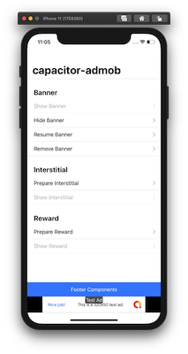
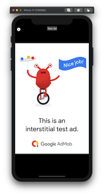
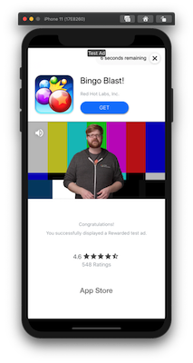
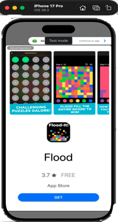
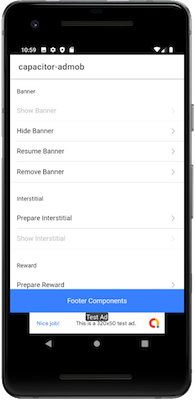
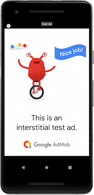
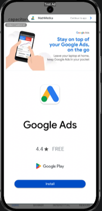

<!-- rdlabo-docs-omit -->
<p align="center"><br></p>
<h3 align="center">AdMob</h3>
<p align="center"><strong><code>@capacitor-community/admob</code></strong></p>
<p align="center">
  Capacitor community plugin for native AdMob.
</p>

<p align="center">
  <strong><a href="https://docs.rdlabo.dev/projects/capacitor-admob">Read the full documentation</a></strong>
</p>

<p align="center">
  
  <a href="https://www.npmjs.com/package/@capacitor-community/admob"></a>
<br>
  <a href="https://www.npmjs.com/package/@capacitor-community/admob"></a>
  <a href="https://www.npmjs.com/package/@capacitor-community/admob"></a>
</p>

## Maintainers

| Maintainer          | GitHub                                           | Social                                          | Website                                         |
| ------------------- | ------------------------------------------------ | ----------------------------------------------- | ----------------------------------------------- |
| Masahiko Sakakibara | [rdlabo](https://github.com/rdlabo)              | [@rdlabo](https://twitter.com/rdlabo)           | [rdlabo.dev](https://rdlabo.dev/)               |
| Saninn Salas Diaz   | [Saninn Salas Diaz](https://github.com/distante) | [@SaninnSalas](https://twitter.com/SaninnSalas) | —                                               |

Maintenance Status: Actively Maintained

## Contributors ✨

<a href="https://github.com/capacitor-community/admob/graphs/contributors">
  
</a>

Made with [contributors-img](https://contrib.rocks).

## Demo

[Demo code is here.](https://github.com/capacitor-community/admob/tree/main/demo)

### Screenshots

|             |                Banner                |                Interstitial                |                Reward                |              App Open               |
| :---------- | :----------------------------------: | :----------------------------------------: | :----------------------------------: | :---------------------------------: |
| **iOS**     |  |  |  |   |
| **Android** |   |   |   |    |

<!-- /rdlabo-docs-omit -->

## Overview

Capacitor community plugin for native AdMob. This plugin wraps the Google Mobile Ads SDK for iOS and Android so you can display banner, interstitial, rewarded, rewarded interstitial, and app open ads in Capacitor apps.

## Features

- Banner ads (including adaptive banners)
- Interstitial ads
- Rewarded video ads
- Rewarded interstitial ads
- App open ads
- Google User Messaging Platform (UMP) consent support
- App Tracking Transparency (iOS tracking permission) helpers

### Choose by advertising goal

| Goal                                                              | Ad format                 | Guide                                      |
| ----------------------------------------------------------------- | ------------------------- | ------------------------------------------ |
| Keep an ad visible alongside app content                          | Banner                    | [Banner Ads](./docs/banner.md)             |
| Show a full-screen ad at a natural break without granting a reward | Interstitial              | [Interstitial Ads](./docs/interstitial.md) |
| Offer a dedicated rewarded experience                             | Rewarded                  | [Rewarded Ads](./docs/rewarded.md)         |
| Offer a reward at a natural transition                            | Rewarded interstitial     | [Rewarded Ads](./docs/rewarded.md)         |
| Monetize an app-open experience                                   | App Open                  | [App Open Ads](./docs/app-open.md)         |

## Quick start

After [Installation](#installation), initialize the SDK, request consent, and show a banner:

```ts
import { AdMob, AdmobConsentStatus, BannerAdOptions, BannerAdSize, BannerAdPosition } from '@capacitor-community/admob';

async function startAdMob() {
  await AdMob.initialize();

  let consentInfo = await AdMob.requestConsentInfo();
  if (consentInfo.isConsentFormAvailable && consentInfo.status === AdmobConsentStatus.REQUIRED) {
    consentInfo = await AdMob.showConsentForm();
  }

  if (!consentInfo.canRequestAds) {
    return;
  }

  const options: BannerAdOptions = {
    adId: 'YOUR_AD_UNIT_ID',
    adSize: BannerAdSize.ADAPTIVE_BANNER,
    position: BannerAdPosition.BOTTOM_CENTER,
    margin: 0,
  };
  await AdMob.showBanner(options);
}
```

The banner sits on the native screen above the WebView, so it can cover your HTML. See [Banner Ads](./docs/banner.md) to inset your layout. Details: [Configuration](./docs/configuration.md), [Consent](./docs/consent.md), and the per-format guides.

## Installation

This plugin already ships Google Mobile Ads SDK. Install the package, then add your AdMob **application** ID in AndroidManifest / Info.plist. Google's Get started guides for [Android](https://developers.google.com/admob/android/quick-start) and [iOS](https://developers.google.com/admob/ios/quick-start) explain app IDs and SKAdNetwork identifiers (Apple's ad conversion IDs); do not add a second Mobile Ads dependency.

This plugin targets `@capacitor-community/admob` **v8** and Capacitor 8. It supports iOS 15 or later and Android API 24 or later.

```bash
npm install @capacitor-community/admob
npx cap sync
```

If you still use Capacitor 7, install `@capacitor-community/admob@7`.

### Google Mobile Ads SDK versions

This major version pins Google Mobile Ads SDK **25.4.x** on Android and **13.6.0** on iOS (Swift Package Manager and CocoaPods). Leave those versions unless you have a specific need. Google's [Next-Gen SDK for Android](https://developers.google.com/admob/android/next-gen) waits until the next plugin major. See [Migration](./docs/migration.md) for the policy behind the pins.

### Android configuration

In `android/app/src/main/AndroidManifest.xml`, add the following under `<application>`:

```xml
<meta-data
  android:name="com.google.android.gms.ads.APPLICATION_ID"
  android:value="@string/admob_app_id" />
```

In `android/app/src/main/res/values/strings.xml`:

```xml
<string name="admob_app_id">[APP_ID]</string>
```

Replace `[APP_ID]` with your AdMob **application** ID, not an ad unit ID.

#### Variables

You can leave these unset. Override them in your app's `variables.gradle` only when you need a specific artifact version:

| Variable                       | Artifact                                         | Default  |
| ------------------------------ | ------------------------------------------------ | -------- |
| `playServicesAdsVersion`       | `com.google.android.gms:play-services-ads`       | `25.4.+` |
| `userMessagingPlatformVersion` | `com.google.android.ump:user-messaging-platform` | `4.0.0`  |
| `androidxCoreKTXVersion`       | `androidx.core:core-ktx`                         | `1.15.0` |

### iOS configuration

Add the following inside the outermost `<dict>` in `ios/App/App/Info.plist`:

```xml
<key>GADIsAdManagerApp</key>
<true/>
<key>GADApplicationIdentifier</key>
<string>[APP_ID]</string>
<key>SKAdNetworkItems</key>
<array>
  <dict>
    <key>SKAdNetworkIdentifier</key>
    <string>cstr6suwn9.skadnetwork</string>
  </dict>
</array>
<key>NSUserTrackingUsageDescription</key>
<string>This identifier will be used to deliver personalized ads to you.</string>
```

Replace `[APP_ID]` with your AdMob application ID, and describe your actual tracking use in `NSUserTrackingUsageDescription`.

The `SKAdNetworkItems` snippet includes Google's own identifier. Add the other IDs from Google's [iOS setup guide](https://developers.google.com/admob/ios/quick-start#update_your_infoplist).

### Troubleshooting

If CocoaPods cannot resolve `Google-Mobile-Ads-SDK`:

```text
[error] Error running update: Analyzing dependencies
[!] CocoaPods could not find compatible versions for pod "Google-Mobile-Ads-SDK":
```

Run `pod repo update` in `ios/`, then `npx cap sync ios` again.

## Documentation

Start with [Installation](#installation) above, then [Configuration](./docs/configuration.md) and [Consent](./docs/consent.md) before loading ads. Pick an ad format from the table above. The same guides are also on the [documentation site](https://docs.rdlabo.dev/projects/capacitor-admob) (English and Japanese). If you opened this README on npm, use that site for the guides — the `docs/` files live in the GitHub repository. Method signatures are in the API section below.

- [Configuration](./docs/configuration.md) — `AdMob.initialize` and SDK options.
- [Consent](./docs/consent.md) — privacy consent and iOS tracking authorization.
- [Banner Ads](./docs/banner.md) — banner options, lifecycle, and events.
- [Native Ads research preview](./docs/native-ads.md) — unsupported, test-ads-only API for device validation; not production-ready. Its API may change or be removed in a minor release until it is promoted to stable.
- Full-screen ads:
  - [Interstitial Ads](./docs/interstitial.md) — load, show, and multiple prepared ads.
  - [Rewarded Ads](./docs/rewarded.md) — rewarded video, rewarded interstitial, and server-side verification.
- [App Open Ads](./docs/app-open.md) — load and present on foreground transitions.
- [Ad Events](./docs/events.md) — shared lifecycle events, errors, and revenue data.
- [Testing](./docs/testing.md) — demo ad units, test devices, and consent testing.
- [Migration Guide](./docs/migration.md) — historical notes when upgrading from older plugin versions.

<!-- rdlabo-docs-omit -->
## Index

<docgen-index>

* [`initialize(...)`](#initialize)
* [`trackingAuthorizationStatus()`](#trackingauthorizationstatus)
* [`requestTrackingAuthorization()`](#requesttrackingauthorization)
* [`setApplicationMuted(...)`](#setapplicationmuted)
* [`setApplicationVolume(...)`](#setapplicationvolume)
* [`loadAppOpen(...)`](#loadappopen)
* [`showAppOpen(...)`](#showappopen)
* [`isAppOpenLoaded(...)`](#isappopenloaded)
* [`addListener(AppOpenAdPluginEvents.Loaded, ...)`](#addlistenerappopenadplugineventsloaded-)
* [`addListener(AppOpenAdPluginEvents.FailedToLoad, ...)`](#addlistenerappopenadplugineventsfailedtoload-)
* [`addListener(AppOpenAdPluginEvents.Opened, ...)`](#addlistenerappopenadplugineventsopened-)
* [`addListener(AppOpenAdPluginEvents.Closed, ...)`](#addlistenerappopenadplugineventsclosed-)
* [`addListener(AppOpenAdPluginEvents.FailedToShow, ...)`](#addlistenerappopenadplugineventsfailedtoshow-)
* [`addListener(AppOpenAdPluginEvents.AdImpression, ...)`](#addlistenerappopenadplugineventsadimpression-)
* [`showBanner(...)`](#showbanner)
* [`hideBanner()`](#hidebanner)
* [`resumeBanner()`](#resumebanner)
* [`removeBanner()`](#removebanner)
* [`addListener(BannerAdPluginEvents.SizeChanged, ...)`](#addlistenerbanneradplugineventssizechanged-)
* [`addListener(BannerAdPluginEvents.Loaded, ...)`](#addlistenerbanneradplugineventsloaded-)
* [`addListener(BannerAdPluginEvents.FailedToLoad, ...)`](#addlistenerbanneradplugineventsfailedtoload-)
* [`addListener(BannerAdPluginEvents.Opened, ...)`](#addlistenerbanneradplugineventsopened-)
* [`addListener(BannerAdPluginEvents.Closed, ...)`](#addlistenerbanneradplugineventsclosed-)
* [`addListener(BannerAdPluginEvents.AdImpression, ...)`](#addlistenerbanneradplugineventsadimpression-)
* [`addListener(BannerAdPluginEvents.AdPaid, ...)`](#addlistenerbanneradplugineventsadpaid-)
* [`requestConsentInfo(...)`](#requestconsentinfo)
* [`showPrivacyOptionsForm()`](#showprivacyoptionsform)
* [`showConsentForm()`](#showconsentform)
* [`resetConsentInfo()`](#resetconsentinfo)
* [`prepareInterstitial(...)`](#prepareinterstitial)
* [`showInterstitial(...)`](#showinterstitial)
* [`addListener(InterstitialAdPluginEvents.FailedToLoad, ...)`](#addlistenerinterstitialadplugineventsfailedtoload-)
* [`addListener(InterstitialAdPluginEvents.Loaded, ...)`](#addlistenerinterstitialadplugineventsloaded-)
* [`addListener(InterstitialAdPluginEvents.Dismissed, ...)`](#addlistenerinterstitialadplugineventsdismissed-)
* [`addListener(InterstitialAdPluginEvents.FailedToShow, ...)`](#addlistenerinterstitialadplugineventsfailedtoshow-)
* [`addListener(InterstitialAdPluginEvents.Showed, ...)`](#addlistenerinterstitialadplugineventsshowed-)
* [`addListener(InterstitialAdPluginEvents.AdImpression, ...)`](#addlistenerinterstitialadplugineventsadimpression-)
* [`prepareRewardVideoAd(...)`](#preparerewardvideoad)
* [`showRewardVideoAd(...)`](#showrewardvideoad)
* [`addListener(RewardAdPluginEvents.FailedToLoad, ...)`](#addlistenerrewardadplugineventsfailedtoload-)
* [`addListener(RewardAdPluginEvents.Loaded, ...)`](#addlistenerrewardadplugineventsloaded-)
* [`addListener(RewardAdPluginEvents.Rewarded, ...)`](#addlistenerrewardadplugineventsrewarded-)
* [`addListener(RewardAdPluginEvents.Dismissed, ...)`](#addlistenerrewardadplugineventsdismissed-)
* [`addListener(RewardAdPluginEvents.FailedToShow, ...)`](#addlistenerrewardadplugineventsfailedtoshow-)
* [`addListener(RewardAdPluginEvents.Showed, ...)`](#addlistenerrewardadplugineventsshowed-)
* [`addListener(RewardAdPluginEvents.AdImpression, ...)`](#addlistenerrewardadplugineventsadimpression-)
* [`prepareRewardInterstitialAd(...)`](#preparerewardinterstitialad)
* [`showRewardInterstitialAd(...)`](#showrewardinterstitialad)
* [`addListener(RewardInterstitialAdPluginEvents.FailedToLoad, ...)`](#addlistenerrewardinterstitialadplugineventsfailedtoload-)
* [`addListener(RewardInterstitialAdPluginEvents.Loaded, ...)`](#addlistenerrewardinterstitialadplugineventsloaded-)
* [`addListener(RewardInterstitialAdPluginEvents.Rewarded, ...)`](#addlistenerrewardinterstitialadplugineventsrewarded-)
* [`addListener(RewardInterstitialAdPluginEvents.Dismissed, ...)`](#addlistenerrewardinterstitialadplugineventsdismissed-)
* [`addListener(RewardInterstitialAdPluginEvents.FailedToShow, ...)`](#addlistenerrewardinterstitialadplugineventsfailedtoshow-)
* [`addListener(RewardInterstitialAdPluginEvents.Showed, ...)`](#addlistenerrewardinterstitialadplugineventsshowed-)
* [`addListener(RewardInterstitialAdPluginEvents.AdImpression, ...)`](#addlistenerrewardinterstitialadplugineventsadimpression-)
* [Interfaces](#interfaces)
* [Type Aliases](#type-aliases)
* [Enums](#enums)

</docgen-index>

## API

<docgen-api>
<!--Update the source file JSDoc comments and rerun docgen to update the docs below-->

### initialize(...)

```typescript
initialize(options?: AdMobInitializationOptions | undefined) => Promise<void>
```

Initializes the Google Mobile Ads SDK.

| Param         | Type                                                                              | Description                           |
| ------------- | --------------------------------------------------------------------------------- | ------------------------------------- |
| **`options`** | <code><a href="#admobinitializationoptions">AdMobInitializationOptions</a></code> | Optional SDK initialization settings. |

**Since:** 1.1.2

--------------------


### trackingAuthorizationStatus()

```typescript
trackingAuthorizationStatus() => Promise<TrackingAuthorizationStatusInterface>
```

Returns the current App Tracking Transparency authorization status on iOS 14 and later.
Returns `authorized` on earlier iOS versions, Android, and web.

**Returns:** <code>Promise&lt;<a href="#trackingauthorizationstatusinterface">TrackingAuthorizationStatusInterface</a>&gt;</code>

**Since:** 3.1.0

--------------------


### requestTrackingAuthorization()

```typescript
requestTrackingAuthorization() => Promise<void>
```

Requests App Tracking Transparency authorization on iOS 14 and later.
Resolves without taking action on earlier iOS versions, Android, and web.

**Since:** 5.2.0

--------------------


### setApplicationMuted(...)

```typescript
setApplicationMuted(options: ApplicationMutedOptions) => Promise<void>
```

Reports whether the application audio is muted to the Google Mobile Ads SDK.

| Param         | Type                                                                        |
| ------------- | --------------------------------------------------------------------------- |
| **`options`** | <code><a href="#applicationmutedoptions">ApplicationMutedOptions</a></code> |

**Since:** 4.1.1

--------------------


### setApplicationVolume(...)

```typescript
setApplicationVolume(options: ApplicationVolumeOptions) => Promise<void>
```

Reports the application audio volume to the Google Mobile Ads SDK.

| Param         | Type                                                                          |
| ------------- | ----------------------------------------------------------------------------- |
| **`options`** | <code><a href="#applicationvolumeoptions">ApplicationVolumeOptions</a></code> |

**Since:** 4.1.1

--------------------


### loadAppOpen(...)

```typescript
loadAppOpen(options: AppOpenAdOptions) => Promise<AdLoadInfo>
```

Loads an App Open ad and returns the loaded ad unit ID.

| Param         | Type                                                          |
| ------------- | ------------------------------------------------------------- |
| **`options`** | <code><a href="#appopenadoptions">AppOpenAdOptions</a></code> |

**Returns:** <code>Promise&lt;<a href="#adloadinfo">AdLoadInfo</a>&gt;</code>

--------------------


### showAppOpen(...)

```typescript
showAppOpen(options?: AdShowOptions | undefined) => Promise<void>
```

Shows a loaded App Open ad.

| Param         | Type                                                    | Description                                                                            |
| ------------- | ------------------------------------------------------- | -------------------------------------------------------------------------------------- |
| **`options`** | <code><a href="#adshowoptions">AdShowOptions</a></code> | Optional. Pass { adId } to show a specific prepared ad instead of the most recent one. |

--------------------


### isAppOpenLoaded(...)

```typescript
isAppOpenLoaded(options?: AdShowOptions | undefined) => Promise<{ value: boolean; }>
```

Checks whether an App Open ad is loaded.

| Param         | Type                                                    | Description                                                                            |
| ------------- | ------------------------------------------------------- | -------------------------------------------------------------------------------------- |
| **`options`** | <code><a href="#adshowoptions">AdShowOptions</a></code> | Optional. Pass an adId to check a specific prepared ad instead of the most recent one. |

**Returns:** <code>Promise&lt;{ value: boolean; }&gt;</code>

--------------------


### addListener(AppOpenAdPluginEvents.Loaded, ...)

```typescript
addListener(eventName: AppOpenAdPluginEvents.Loaded, listenerFunc: (info: AdLoadInfo) => void) => Promise<PluginListenerHandle>
```

Listens for App Open ad load events.

| Param              | Type                                                                           |
| ------------------ | ------------------------------------------------------------------------------ |
| **`eventName`**    | <code><a href="#appopenadpluginevents">AppOpenAdPluginEvents.Loaded</a></code> |
| **`listenerFunc`** | <code>(info: <a href="#adloadinfo">AdLoadInfo</a>) =&gt; void</code>           |

**Returns:** <code>Promise&lt;<a href="#pluginlistenerhandle">PluginListenerHandle</a>&gt;</code>

--------------------


### addListener(AppOpenAdPluginEvents.FailedToLoad, ...)

```typescript
addListener(eventName: AppOpenAdPluginEvents.FailedToLoad, listenerFunc: (error: AdMobError) => void) => Promise<PluginListenerHandle>
```

Listens for App Open ad load failures.

| Param              | Type                                                                                 |
| ------------------ | ------------------------------------------------------------------------------------ |
| **`eventName`**    | <code><a href="#appopenadpluginevents">AppOpenAdPluginEvents.FailedToLoad</a></code> |
| **`listenerFunc`** | <code>(error: <a href="#admoberror">AdMobError</a>) =&gt; void</code>                |

**Returns:** <code>Promise&lt;<a href="#pluginlistenerhandle">PluginListenerHandle</a>&gt;</code>

--------------------


### addListener(AppOpenAdPluginEvents.Opened, ...)

```typescript
addListener(eventName: AppOpenAdPluginEvents.Opened, listenerFunc: () => void) => Promise<PluginListenerHandle>
```

Listens for App Open ad opened events.

| Param              | Type                                                                           |
| ------------------ | ------------------------------------------------------------------------------ |
| **`eventName`**    | <code><a href="#appopenadpluginevents">AppOpenAdPluginEvents.Opened</a></code> |
| **`listenerFunc`** | <code>() =&gt; void</code>                                                     |

**Returns:** <code>Promise&lt;<a href="#pluginlistenerhandle">PluginListenerHandle</a>&gt;</code>

--------------------


### addListener(AppOpenAdPluginEvents.Closed, ...)

```typescript
addListener(eventName: AppOpenAdPluginEvents.Closed, listenerFunc: () => void) => Promise<PluginListenerHandle>
```

Listens for App Open ad closed events.

| Param              | Type                                                                           |
| ------------------ | ------------------------------------------------------------------------------ |
| **`eventName`**    | <code><a href="#appopenadpluginevents">AppOpenAdPluginEvents.Closed</a></code> |
| **`listenerFunc`** | <code>() =&gt; void</code>                                                     |

**Returns:** <code>Promise&lt;<a href="#pluginlistenerhandle">PluginListenerHandle</a>&gt;</code>

--------------------


### addListener(AppOpenAdPluginEvents.FailedToShow, ...)

```typescript
addListener(eventName: AppOpenAdPluginEvents.FailedToShow, listenerFunc: (error: AdMobError) => void) => Promise<PluginListenerHandle>
```

Listens for App Open ad show failures.

| Param              | Type                                                                                 |
| ------------------ | ------------------------------------------------------------------------------------ |
| **`eventName`**    | <code><a href="#appopenadpluginevents">AppOpenAdPluginEvents.FailedToShow</a></code> |
| **`listenerFunc`** | <code>(error: <a href="#admoberror">AdMobError</a>) =&gt; void</code>                |

**Returns:** <code>Promise&lt;<a href="#pluginlistenerhandle">PluginListenerHandle</a>&gt;</code>

--------------------


### addListener(AppOpenAdPluginEvents.AdImpression, ...)

```typescript
addListener(eventName: AppOpenAdPluginEvents.AdImpression, listenerFunc: (data: AdMobRevenueData) => void) => Promise<PluginListenerHandle>
```

Listens for App Open impression-level ad revenue events.

| Param              | Type                                                                                 |
| ------------------ | ------------------------------------------------------------------------------------ |
| **`eventName`**    | <code><a href="#appopenadpluginevents">AppOpenAdPluginEvents.AdImpression</a></code> |
| **`listenerFunc`** | <code>(data: <a href="#admobrevenuedata">AdMobRevenueData</a>) =&gt; void</code>     |

**Returns:** <code>Promise&lt;<a href="#pluginlistenerhandle">PluginListenerHandle</a>&gt;</code>

--------------------


### showBanner(...)

```typescript
showBanner(options: BannerAdOptions) => Promise<void>
```

Displays a banner ad.

| Param         | Type                                                        | Description                        |
| ------------- | ----------------------------------------------------------- | ---------------------------------- |
| **`options`** | <code><a href="#banneradoptions">BannerAdOptions</a></code> | <a href="#adoptions">AdOptions</a> |

**Since:** 1.1.2

--------------------


### hideBanner()

```typescript
hideBanner() => Promise<void>
```

Hides the current banner without destroying it.

**Since:** 1.1.2

--------------------


### resumeBanner()

```typescript
resumeBanner() => Promise<void>
```

Shows a previously hidden banner.

**Since:** 1.1.2

--------------------


### removeBanner()

```typescript
removeBanner() => Promise<void>
```

Destroys the current banner and removes it from the screen.

**Since:** 1.1.2

--------------------


### addListener(BannerAdPluginEvents.SizeChanged, ...)

```typescript
addListener(eventName: BannerAdPluginEvents.SizeChanged, listenerFunc: (info: AdMobBannerSize) => void) => Promise<PluginListenerHandle>
```

Listens for changes to the displayed banner dimensions.

| Param              | Type                                                                              | Description         |
| ------------------ | --------------------------------------------------------------------------------- | ------------------- |
| **`eventName`**    | <code><a href="#banneradpluginevents">BannerAdPluginEvents.SizeChanged</a></code> | bannerAdSizeChanged |
| **`listenerFunc`** | <code>(info: <a href="#admobbannersize">AdMobBannerSize</a>) =&gt; void</code>    |                     |

**Returns:** <code>Promise&lt;<a href="#pluginlistenerhandle">PluginListenerHandle</a>&gt;</code>

**Since:** 3.0.0

--------------------


### addListener(BannerAdPluginEvents.Loaded, ...)

```typescript
addListener(eventName: BannerAdPluginEvents.Loaded, listenerFunc: () => void) => Promise<PluginListenerHandle>
```

Listens for banner ad load events.

| Param              | Type                                                                         | Description    |
| ------------------ | ---------------------------------------------------------------------------- | -------------- |
| **`eventName`**    | <code><a href="#banneradpluginevents">BannerAdPluginEvents.Loaded</a></code> | bannerAdLoaded |
| **`listenerFunc`** | <code>() =&gt; void</code>                                                   |                |

**Returns:** <code>Promise&lt;<a href="#pluginlistenerhandle">PluginListenerHandle</a>&gt;</code>

**Since:** 3.0.0

--------------------


### addListener(BannerAdPluginEvents.FailedToLoad, ...)

```typescript
addListener(eventName: BannerAdPluginEvents.FailedToLoad, listenerFunc: (info: AdMobError) => void) => Promise<PluginListenerHandle>
```

Listens for banner ad load failures.

| Param              | Type                                                                               | Description          |
| ------------------ | ---------------------------------------------------------------------------------- | -------------------- |
| **`eventName`**    | <code><a href="#banneradpluginevents">BannerAdPluginEvents.FailedToLoad</a></code> | bannerAdFailedToLoad |
| **`listenerFunc`** | <code>(info: <a href="#admoberror">AdMobError</a>) =&gt; void</code>               |                      |

**Returns:** <code>Promise&lt;<a href="#pluginlistenerhandle">PluginListenerHandle</a>&gt;</code>

**Since:** 3.0.0

--------------------


### addListener(BannerAdPluginEvents.Opened, ...)

```typescript
addListener(eventName: BannerAdPluginEvents.Opened, listenerFunc: () => void) => Promise<PluginListenerHandle>
```

Listens for banner overlay opened events.

| Param              | Type                                                                         | Description    |
| ------------------ | ---------------------------------------------------------------------------- | -------------- |
| **`eventName`**    | <code><a href="#banneradpluginevents">BannerAdPluginEvents.Opened</a></code> | bannerAdOpened |
| **`listenerFunc`** | <code>() =&gt; void</code>                                                   |                |

**Returns:** <code>Promise&lt;<a href="#pluginlistenerhandle">PluginListenerHandle</a>&gt;</code>

**Since:** 3.0.0

--------------------


### addListener(BannerAdPluginEvents.Closed, ...)

```typescript
addListener(eventName: BannerAdPluginEvents.Closed, listenerFunc: () => void) => Promise<PluginListenerHandle>
```

Listens for banner overlay closed events.

| Param              | Type                                                                         | Description    |
| ------------------ | ---------------------------------------------------------------------------- | -------------- |
| **`eventName`**    | <code><a href="#banneradpluginevents">BannerAdPluginEvents.Closed</a></code> | bannerAdClosed |
| **`listenerFunc`** | <code>() =&gt; void</code>                                                   |                |

**Returns:** <code>Promise&lt;<a href="#pluginlistenerhandle">PluginListenerHandle</a>&gt;</code>

**Since:** 3.0.0

--------------------


### addListener(BannerAdPluginEvents.AdImpression, ...)

```typescript
addListener(eventName: BannerAdPluginEvents.AdImpression, listenerFunc: () => void) => Promise<PluginListenerHandle>
```

Listens for banner impression events.

| Param              | Type                                                                               | Description  |
| ------------------ | ---------------------------------------------------------------------------------- | ------------ |
| **`eventName`**    | <code><a href="#banneradpluginevents">BannerAdPluginEvents.AdImpression</a></code> | AdImpression |
| **`listenerFunc`** | <code>() =&gt; void</code>                                                         |              |

**Returns:** <code>Promise&lt;<a href="#pluginlistenerhandle">PluginListenerHandle</a>&gt;</code>

**Since:** 3.0.0

--------------------


### addListener(BannerAdPluginEvents.AdPaid, ...)

```typescript
addListener(eventName: BannerAdPluginEvents.AdPaid, listenerFunc: (data: AdMobRevenueData) => void) => Promise<PluginListenerHandle>
```

Listens for banner impression-level ad revenue events.

| Param              | Type                                                                             |
| ------------------ | -------------------------------------------------------------------------------- |
| **`eventName`**    | <code><a href="#banneradpluginevents">BannerAdPluginEvents.AdPaid</a></code>     |
| **`listenerFunc`** | <code>(data: <a href="#admobrevenuedata">AdMobRevenueData</a>) =&gt; void</code> |

**Returns:** <code>Promise&lt;<a href="#pluginlistenerhandle">PluginListenerHandle</a>&gt;</code>

--------------------


### requestConsentInfo(...)

```typescript
requestConsentInfo(options?: AdmobConsentRequestOptions | undefined) => Promise<AdmobConsentInfo>
```

Request user consent information

| Param         | Type                                                                              | Description           |
| ------------- | --------------------------------------------------------------------------------- | --------------------- |
| **`options`** | <code><a href="#admobconsentrequestoptions">AdmobConsentRequestOptions</a></code> | ConsentRequestOptions |

**Returns:** <code>Promise&lt;<a href="#admobconsentinfo">AdmobConsentInfo</a>&gt;</code>

**Since:** 5.0.0

--------------------


### showPrivacyOptionsForm()

```typescript
showPrivacyOptionsForm() => Promise<void>
```

Shows a google privacy options form (rendered from your GDPR message config).

**Since:** 7.0.3

--------------------


### showConsentForm()

```typescript
showConsentForm() => Promise<AdmobConsentInfo>
```

Shows a google user consent form (rendered from your GDPR message config).

**Returns:** <code>Promise&lt;<a href="#admobconsentinfo">AdmobConsentInfo</a>&gt;</code>

**Since:** 5.0.0

--------------------


### resetConsentInfo()

```typescript
resetConsentInfo() => Promise<void>
```

Resets the UMP SDK state. Call requestConsentInfo function again to allow user modify their consent

**Since:** 5.0.0

--------------------


### prepareInterstitial(...)

```typescript
prepareInterstitial(options: AdOptions) => Promise<AdLoadInfo>
```

Loads an interstitial ad and returns the loaded ad unit ID.

| Param         | Type                                            | Description                        |
| ------------- | ----------------------------------------------- | ---------------------------------- |
| **`options`** | <code><a href="#adoptions">AdOptions</a></code> | <a href="#adoptions">AdOptions</a> |

**Returns:** <code>Promise&lt;<a href="#adloadinfo">AdLoadInfo</a>&gt;</code>

**Since:** 1.1.2

--------------------


### showInterstitial(...)

```typescript
showInterstitial(options?: AdShowOptions | undefined) => Promise<void>
```

Shows a loaded interstitial ad.

| Param         | Type                                                    | Description                                                                            |
| ------------- | ------------------------------------------------------- | -------------------------------------------------------------------------------------- |
| **`options`** | <code><a href="#adshowoptions">AdShowOptions</a></code> | Optional. Pass { adId } to show a specific prepared ad instead of the most recent one. |

**Since:** 1.1.2

--------------------


### addListener(InterstitialAdPluginEvents.FailedToLoad, ...)

```typescript
addListener(eventName: InterstitialAdPluginEvents.FailedToLoad, listenerFunc: (error: AdMobError) => void) => Promise<PluginListenerHandle>
```

Listens for interstitial ad load failures.

| Param              | Type                                                                                           |
| ------------------ | ---------------------------------------------------------------------------------------------- |
| **`eventName`**    | <code><a href="#interstitialadpluginevents">InterstitialAdPluginEvents.FailedToLoad</a></code> |
| **`listenerFunc`** | <code>(error: <a href="#admoberror">AdMobError</a>) =&gt; void</code>                          |

**Returns:** <code>Promise&lt;<a href="#pluginlistenerhandle">PluginListenerHandle</a>&gt;</code>

--------------------


### addListener(InterstitialAdPluginEvents.Loaded, ...)

```typescript
addListener(eventName: InterstitialAdPluginEvents.Loaded, listenerFunc: (info: AdLoadInfo) => void) => Promise<PluginListenerHandle>
```

Listens for interstitial ad load events.

| Param              | Type                                                                                     |
| ------------------ | ---------------------------------------------------------------------------------------- |
| **`eventName`**    | <code><a href="#interstitialadpluginevents">InterstitialAdPluginEvents.Loaded</a></code> |
| **`listenerFunc`** | <code>(info: <a href="#adloadinfo">AdLoadInfo</a>) =&gt; void</code>                     |

**Returns:** <code>Promise&lt;<a href="#pluginlistenerhandle">PluginListenerHandle</a>&gt;</code>

--------------------


### addListener(InterstitialAdPluginEvents.Dismissed, ...)

```typescript
addListener(eventName: InterstitialAdPluginEvents.Dismissed, listenerFunc: () => void) => Promise<PluginListenerHandle>
```

Listens for interstitial ad dismissed events.

| Param              | Type                                                                                        |
| ------------------ | ------------------------------------------------------------------------------------------- |
| **`eventName`**    | <code><a href="#interstitialadpluginevents">InterstitialAdPluginEvents.Dismissed</a></code> |
| **`listenerFunc`** | <code>() =&gt; void</code>                                                                  |

**Returns:** <code>Promise&lt;<a href="#pluginlistenerhandle">PluginListenerHandle</a>&gt;</code>

--------------------


### addListener(InterstitialAdPluginEvents.FailedToShow, ...)

```typescript
addListener(eventName: InterstitialAdPluginEvents.FailedToShow, listenerFunc: (error: AdMobError) => void) => Promise<PluginListenerHandle>
```

Listens for interstitial ad show failures.

| Param              | Type                                                                                           |
| ------------------ | ---------------------------------------------------------------------------------------------- |
| **`eventName`**    | <code><a href="#interstitialadpluginevents">InterstitialAdPluginEvents.FailedToShow</a></code> |
| **`listenerFunc`** | <code>(error: <a href="#admoberror">AdMobError</a>) =&gt; void</code>                          |

**Returns:** <code>Promise&lt;<a href="#pluginlistenerhandle">PluginListenerHandle</a>&gt;</code>

--------------------


### addListener(InterstitialAdPluginEvents.Showed, ...)

```typescript
addListener(eventName: InterstitialAdPluginEvents.Showed, listenerFunc: () => void) => Promise<PluginListenerHandle>
```

Listens for interstitial ad shown events.

| Param              | Type                                                                                     |
| ------------------ | ---------------------------------------------------------------------------------------- |
| **`eventName`**    | <code><a href="#interstitialadpluginevents">InterstitialAdPluginEvents.Showed</a></code> |
| **`listenerFunc`** | <code>() =&gt; void</code>                                                               |

**Returns:** <code>Promise&lt;<a href="#pluginlistenerhandle">PluginListenerHandle</a>&gt;</code>

--------------------


### addListener(InterstitialAdPluginEvents.AdImpression, ...)

```typescript
addListener(eventName: InterstitialAdPluginEvents.AdImpression, listenerFunc: (data: AdMobRevenueData) => void) => Promise<PluginListenerHandle>
```

Listens for interstitial impression-level ad revenue events.

| Param              | Type                                                                                           |
| ------------------ | ---------------------------------------------------------------------------------------------- |
| **`eventName`**    | <code><a href="#interstitialadpluginevents">InterstitialAdPluginEvents.AdImpression</a></code> |
| **`listenerFunc`** | <code>(data: <a href="#admobrevenuedata">AdMobRevenueData</a>) =&gt; void</code>               |

**Returns:** <code>Promise&lt;<a href="#pluginlistenerhandle">PluginListenerHandle</a>&gt;</code>

--------------------


### prepareRewardVideoAd(...)

```typescript
prepareRewardVideoAd(options: RewardAdOptions) => Promise<AdLoadInfo>
```

Loads a rewarded ad and returns the loaded ad unit ID.

| Param         | Type                                                        | Description                                    |
| ------------- | ----------------------------------------------------------- | ---------------------------------------------- |
| **`options`** | <code><a href="#rewardadoptions">RewardAdOptions</a></code> | <a href="#rewardadoptions">RewardAdOptions</a> |

**Returns:** <code>Promise&lt;<a href="#adloadinfo">AdLoadInfo</a>&gt;</code>

**Since:** 1.1.2

--------------------


### showRewardVideoAd(...)

```typescript
showRewardVideoAd(options?: AdShowOptions | undefined) => Promise<AdMobRewardItem>
```

Shows a loaded rewarded ad and resolves when the user earns the reward.

| Param         | Type                                                    | Description                                                                            |
| ------------- | ------------------------------------------------------- | -------------------------------------------------------------------------------------- |
| **`options`** | <code><a href="#adshowoptions">AdShowOptions</a></code> | Optional. Pass { adId } to show a specific prepared ad instead of the most recent one. |

**Returns:** <code>Promise&lt;<a href="#admobrewarditem">AdMobRewardItem</a>&gt;</code>

**Since:** 1.1.2

--------------------


### addListener(RewardAdPluginEvents.FailedToLoad, ...)

```typescript
addListener(eventName: RewardAdPluginEvents.FailedToLoad, listenerFunc: (error: AdMobError) => void) => Promise<PluginListenerHandle>
```

Listens for rewarded ad load failures.

| Param              | Type                                                                               |
| ------------------ | ---------------------------------------------------------------------------------- |
| **`eventName`**    | <code><a href="#rewardadpluginevents">RewardAdPluginEvents.FailedToLoad</a></code> |
| **`listenerFunc`** | <code>(error: <a href="#admoberror">AdMobError</a>) =&gt; void</code>              |

**Returns:** <code>Promise&lt;<a href="#pluginlistenerhandle">PluginListenerHandle</a>&gt;</code>

--------------------


### addListener(RewardAdPluginEvents.Loaded, ...)

```typescript
addListener(eventName: RewardAdPluginEvents.Loaded, listenerFunc: (info: AdLoadInfo) => void) => Promise<PluginListenerHandle>
```

Listens for rewarded ad load events.

| Param              | Type                                                                         |
| ------------------ | ---------------------------------------------------------------------------- |
| **`eventName`**    | <code><a href="#rewardadpluginevents">RewardAdPluginEvents.Loaded</a></code> |
| **`listenerFunc`** | <code>(info: <a href="#adloadinfo">AdLoadInfo</a>) =&gt; void</code>         |

**Returns:** <code>Promise&lt;<a href="#pluginlistenerhandle">PluginListenerHandle</a>&gt;</code>

--------------------


### addListener(RewardAdPluginEvents.Rewarded, ...)

```typescript
addListener(eventName: RewardAdPluginEvents.Rewarded, listenerFunc: (reward: AdMobRewardItem) => void) => Promise<PluginListenerHandle>
```

Listens for earned reward events.

| Param              | Type                                                                             |
| ------------------ | -------------------------------------------------------------------------------- |
| **`eventName`**    | <code><a href="#rewardadpluginevents">RewardAdPluginEvents.Rewarded</a></code>   |
| **`listenerFunc`** | <code>(reward: <a href="#admobrewarditem">AdMobRewardItem</a>) =&gt; void</code> |

**Returns:** <code>Promise&lt;<a href="#pluginlistenerhandle">PluginListenerHandle</a>&gt;</code>

--------------------


### addListener(RewardAdPluginEvents.Dismissed, ...)

```typescript
addListener(eventName: RewardAdPluginEvents.Dismissed, listenerFunc: () => void) => Promise<PluginListenerHandle>
```

Listens for rewarded ad dismissed events.

| Param              | Type                                                                            |
| ------------------ | ------------------------------------------------------------------------------- |
| **`eventName`**    | <code><a href="#rewardadpluginevents">RewardAdPluginEvents.Dismissed</a></code> |
| **`listenerFunc`** | <code>() =&gt; void</code>                                                      |

**Returns:** <code>Promise&lt;<a href="#pluginlistenerhandle">PluginListenerHandle</a>&gt;</code>

--------------------


### addListener(RewardAdPluginEvents.FailedToShow, ...)

```typescript
addListener(eventName: RewardAdPluginEvents.FailedToShow, listenerFunc: (error: AdMobError) => void) => Promise<PluginListenerHandle>
```

Listens for rewarded ad show failures.

| Param              | Type                                                                               |
| ------------------ | ---------------------------------------------------------------------------------- |
| **`eventName`**    | <code><a href="#rewardadpluginevents">RewardAdPluginEvents.FailedToShow</a></code> |
| **`listenerFunc`** | <code>(error: <a href="#admoberror">AdMobError</a>) =&gt; void</code>              |

**Returns:** <code>Promise&lt;<a href="#pluginlistenerhandle">PluginListenerHandle</a>&gt;</code>

--------------------


### addListener(RewardAdPluginEvents.Showed, ...)

```typescript
addListener(eventName: RewardAdPluginEvents.Showed, listenerFunc: () => void) => Promise<PluginListenerHandle>
```

Listens for rewarded ad shown events.

| Param              | Type                                                                         |
| ------------------ | ---------------------------------------------------------------------------- |
| **`eventName`**    | <code><a href="#rewardadpluginevents">RewardAdPluginEvents.Showed</a></code> |
| **`listenerFunc`** | <code>() =&gt; void</code>                                                   |

**Returns:** <code>Promise&lt;<a href="#pluginlistenerhandle">PluginListenerHandle</a>&gt;</code>

--------------------


### addListener(RewardAdPluginEvents.AdImpression, ...)

```typescript
addListener(eventName: RewardAdPluginEvents.AdImpression, listenerFunc: (data: AdMobRevenueData) => void) => Promise<PluginListenerHandle>
```

Listens for rewarded impression-level ad revenue events.

| Param              | Type                                                                               |
| ------------------ | ---------------------------------------------------------------------------------- |
| **`eventName`**    | <code><a href="#rewardadpluginevents">RewardAdPluginEvents.AdImpression</a></code> |
| **`listenerFunc`** | <code>(data: <a href="#admobrevenuedata">AdMobRevenueData</a>) =&gt; void</code>   |

**Returns:** <code>Promise&lt;<a href="#pluginlistenerhandle">PluginListenerHandle</a>&gt;</code>

--------------------


### prepareRewardInterstitialAd(...)

```typescript
prepareRewardInterstitialAd(options: RewardInterstitialAdOptions) => Promise<AdLoadInfo>
```

Loads a rewarded interstitial ad and returns the loaded ad unit ID.

| Param         | Type                                                                                | Description                                                            |
| ------------- | ----------------------------------------------------------------------------------- | ---------------------------------------------------------------------- |
| **`options`** | <code><a href="#rewardinterstitialadoptions">RewardInterstitialAdOptions</a></code> | <a href="#rewardinterstitialadoptions">RewardInterstitialAdOptions</a> |

**Returns:** <code>Promise&lt;<a href="#adloadinfo">AdLoadInfo</a>&gt;</code>

**Since:** 1.1.2

--------------------


### showRewardInterstitialAd(...)

```typescript
showRewardInterstitialAd(options?: AdShowOptions | undefined) => Promise<AdMobRewardInterstitialItem>
```

Shows a loaded rewarded interstitial ad and resolves when the user earns the reward.

| Param         | Type                                                    | Description                                                                            |
| ------------- | ------------------------------------------------------- | -------------------------------------------------------------------------------------- |
| **`options`** | <code><a href="#adshowoptions">AdShowOptions</a></code> | Optional. Pass { adId } to show a specific prepared ad instead of the most recent one. |

**Returns:** <code>Promise&lt;<a href="#admobrewardinterstitialitem">AdMobRewardInterstitialItem</a>&gt;</code>

**Since:** 1.1.2

--------------------


### addListener(RewardInterstitialAdPluginEvents.FailedToLoad, ...)

```typescript
addListener(eventName: RewardInterstitialAdPluginEvents.FailedToLoad, listenerFunc: (error: AdMobError) => void) => Promise<PluginListenerHandle>
```

Listens for rewarded interstitial ad load failures.

| Param              | Type                                                                                                       |
| ------------------ | ---------------------------------------------------------------------------------------------------------- |
| **`eventName`**    | <code><a href="#rewardinterstitialadpluginevents">RewardInterstitialAdPluginEvents.FailedToLoad</a></code> |
| **`listenerFunc`** | <code>(error: <a href="#admoberror">AdMobError</a>) =&gt; void</code>                                      |

**Returns:** <code>Promise&lt;<a href="#pluginlistenerhandle">PluginListenerHandle</a>&gt;</code>

--------------------


### addListener(RewardInterstitialAdPluginEvents.Loaded, ...)

```typescript
addListener(eventName: RewardInterstitialAdPluginEvents.Loaded, listenerFunc: (info: AdLoadInfo) => void) => Promise<PluginListenerHandle>
```

Listens for rewarded interstitial ad load events.

| Param              | Type                                                                                                 |
| ------------------ | ---------------------------------------------------------------------------------------------------- |
| **`eventName`**    | <code><a href="#rewardinterstitialadpluginevents">RewardInterstitialAdPluginEvents.Loaded</a></code> |
| **`listenerFunc`** | <code>(info: <a href="#adloadinfo">AdLoadInfo</a>) =&gt; void</code>                                 |

**Returns:** <code>Promise&lt;<a href="#pluginlistenerhandle">PluginListenerHandle</a>&gt;</code>

--------------------


### addListener(RewardInterstitialAdPluginEvents.Rewarded, ...)

```typescript
addListener(eventName: RewardInterstitialAdPluginEvents.Rewarded, listenerFunc: (reward: AdMobRewardInterstitialItem) => void) => Promise<PluginListenerHandle>
```

Listens for earned reward events.

| Param              | Type                                                                                                     |
| ------------------ | -------------------------------------------------------------------------------------------------------- |
| **`eventName`**    | <code><a href="#rewardinterstitialadpluginevents">RewardInterstitialAdPluginEvents.Rewarded</a></code>   |
| **`listenerFunc`** | <code>(reward: <a href="#admobrewardinterstitialitem">AdMobRewardInterstitialItem</a>) =&gt; void</code> |

**Returns:** <code>Promise&lt;<a href="#pluginlistenerhandle">PluginListenerHandle</a>&gt;</code>

--------------------


### addListener(RewardInterstitialAdPluginEvents.Dismissed, ...)

```typescript
addListener(eventName: RewardInterstitialAdPluginEvents.Dismissed, listenerFunc: () => void) => Promise<PluginListenerHandle>
```

Listens for rewarded interstitial ad dismissed events.

| Param              | Type                                                                                                    |
| ------------------ | ------------------------------------------------------------------------------------------------------- |
| **`eventName`**    | <code><a href="#rewardinterstitialadpluginevents">RewardInterstitialAdPluginEvents.Dismissed</a></code> |
| **`listenerFunc`** | <code>() =&gt; void</code>                                                                              |

**Returns:** <code>Promise&lt;<a href="#pluginlistenerhandle">PluginListenerHandle</a>&gt;</code>

--------------------


### addListener(RewardInterstitialAdPluginEvents.FailedToShow, ...)

```typescript
addListener(eventName: RewardInterstitialAdPluginEvents.FailedToShow, listenerFunc: (error: AdMobError) => void) => Promise<PluginListenerHandle>
```

Listens for rewarded interstitial ad show failures.

| Param              | Type                                                                                                       |
| ------------------ | ---------------------------------------------------------------------------------------------------------- |
| **`eventName`**    | <code><a href="#rewardinterstitialadpluginevents">RewardInterstitialAdPluginEvents.FailedToShow</a></code> |
| **`listenerFunc`** | <code>(error: <a href="#admoberror">AdMobError</a>) =&gt; void</code>                                      |

**Returns:** <code>Promise&lt;<a href="#pluginlistenerhandle">PluginListenerHandle</a>&gt;</code>

--------------------


### addListener(RewardInterstitialAdPluginEvents.Showed, ...)

```typescript
addListener(eventName: RewardInterstitialAdPluginEvents.Showed, listenerFunc: () => void) => Promise<PluginListenerHandle>
```

Listens for rewarded interstitial ad shown events.

| Param              | Type                                                                                                 |
| ------------------ | ---------------------------------------------------------------------------------------------------- |
| **`eventName`**    | <code><a href="#rewardinterstitialadpluginevents">RewardInterstitialAdPluginEvents.Showed</a></code> |
| **`listenerFunc`** | <code>() =&gt; void</code>                                                                           |

**Returns:** <code>Promise&lt;<a href="#pluginlistenerhandle">PluginListenerHandle</a>&gt;</code>

--------------------


### addListener(RewardInterstitialAdPluginEvents.AdImpression, ...)

```typescript
addListener(eventName: RewardInterstitialAdPluginEvents.AdImpression, listenerFunc: (data: AdMobRevenueData) => void) => Promise<PluginListenerHandle>
```

Listens for rewarded interstitial impression-level ad revenue events.

| Param              | Type                                                                                                       |
| ------------------ | ---------------------------------------------------------------------------------------------------------- |
| **`eventName`**    | <code><a href="#rewardinterstitialadpluginevents">RewardInterstitialAdPluginEvents.AdImpression</a></code> |
| **`listenerFunc`** | <code>(data: <a href="#admobrevenuedata">AdMobRevenueData</a>) =&gt; void</code>                           |

**Returns:** <code>Promise&lt;<a href="#pluginlistenerhandle">PluginListenerHandle</a>&gt;</code>

--------------------


### Interfaces


#### AdMobInitializationOptions

| Prop                               | Type                                                              | Description                                                                                                                                                                                                                                     | Default            | Since |
| ---------------------------------- | ----------------------------------------------------------------- | ----------------------------------------------------------------------------------------------------------------------------------------------------------------------------------------------------------------------------------------------- | ------------------ | ----- |
| **`testingDevices`**               | <code>string[]</code>                                             | Device IDs to register as test devices when {@link <a href="#admobinitializationoptions">AdMobInitializationOptions.initializeForTesting</a>} is `true`. Requests from registered devices receive test ads and do not generate invalid traffic. |                    | 1.2.0 |
| **`initializeForTesting`**         | <code>boolean</code>                                              | Whether to register {@link <a href="#admobinitializationoptions">AdMobInitializationOptions.testingDevices</a>} as test devices.                                                                                                                | <code>false</code> | 1.2.0 |
| **`tagForChildDirectedTreatment`** | <code>boolean</code>                                              | For purposes of the Children's Online Privacy Protection Act (COPPA), there is a setting called tagForChildDirectedTreatment.                                                                                                                   |                    | 3.1.0 |
| **`tagForUnderAgeOfConsent`**      | <code>boolean</code>                                              | When using this feature, a Tag For Users under the Age of Consent in Europe (TFUA) parameter will be included in all future ad requests.                                                                                                        |                    | 3.1.0 |
| **`maxAdContentRating`**           | <code><a href="#maxadcontentrating">MaxAdContentRating</a></code> | The maximum ad content rating applied to all ad requests. Ads with a higher rating are excluded.                                                                                                                                                |                    | 3.1.0 |


#### TrackingAuthorizationStatusInterface

The current iOS App Tracking Transparency authorization status.

| Prop         | Type                                                                     | Description                                                     |
| ------------ | ------------------------------------------------------------------------ | --------------------------------------------------------------- |
| **`status`** | <code>'authorized' \| 'denied' \| 'notDetermined' \| 'restricted'</code> | The authorization status reported by App Tracking Transparency. |


#### ApplicationMutedOptions

| Prop        | Type                 | Description                                                                                                                                                                                                                                                                                           | Since |
| ----------- | -------------------- | ----------------------------------------------------------------------------------------------------------------------------------------------------------------------------------------------------------------------------------------------------------------------------------------------------- | ----- |
| **`muted`** | <code>boolean</code> | To inform the SDK that the app volume has been muted. Note: Video ads that are ineligible to be shown with muted audio are not returned for ad requests made, when the app volume is reported as muted or set to a value of 0. This may restrict a subset of the broader video ads pool from serving. | 4.1.1 |


#### ApplicationVolumeOptions

| Prop         | Type                                                                               | Description                                                                                                                                                                                                                                               | Since |
| ------------ | ---------------------------------------------------------------------------------- | --------------------------------------------------------------------------------------------------------------------------------------------------------------------------------------------------------------------------------------------------------- | ----- |
| **`volume`** | <code>0 \| 1 \| 0.1 \| 0.2 \| 0.3 \| 0.4 \| 0.5 \| 0.6 \| 0.7 \| 0.8 \| 0.9</code> | If your app has its own volume controls (such as custom music or sound effect volumes), disclosing app volume to the Google Mobile Ads SDK allows video ads to respect app volume settings. Use a supported value from 0.0 (silent) to 1.0 (full volume). | 4.1.1 |


#### AdLoadInfo

Information returned after an ad loads successfully.

| Prop           | Type                | Description                      |
| -------------- | ------------------- | -------------------------------- |
| **`adUnitId`** | <code>string</code> | The ad unit ID of the loaded ad. |


#### AppOpenAdOptions

Options for loading an App Open ad.

| Prop       | Type                | Description                      |
| ---------- | ------------------- | -------------------------------- |
| **`adId`** | <code>string</code> | The App Open ad unit ID to load. |


#### AdShowOptions

Options for selecting a previously loaded ad to show or inspect.

| Prop       | Type                | Description                                                                                                            | Since |
| ---------- | ------------------- | ---------------------------------------------------------------------------------------------------------------------- | ----- |
| **`adId`** | <code>string</code> | The ad unit ID of a previously prepared ad to target. If omitted, the operation targets the most recently prepared ad. | 8.0.1 |


#### PluginListenerHandle

| Prop         | Type                                      |
| ------------ | ----------------------------------------- |
| **`remove`** | <code>() =&gt; Promise&lt;void&gt;</code> |


#### AdMobError

An error returned by the Google Mobile Ads SDK.

| Prop          | Type                | Description                            |
| ------------- | ------------------- | -------------------------------------- |
| **`code`**    | <code>number</code> | Gets the error's code.                 |
| **`message`** | <code>string</code> | Gets the message describing the error. |


#### AdMobRevenueData

Impression-level ad revenue data emitted by a paid event.

| Prop               | Type                                                          | Description                                                                                       |
| ------------------ | ------------------------------------------------------------- | ------------------------------------------------------------------------------------------------- |
| **`adUnitId`**     | <code>string</code>                                           | The ad unit ID associated with the paid event.                                                    |
| **`valueMicros`**  | <code>number</code>                                           | The ad value in micros, where 1,000,000 micros equals one currency unit.                          |
| **`currencyCode`** | <code>string</code>                                           | The ISO 4217 currency code for `valueMicros`.                                                     |
| **`precision`**    | <code><a href="#advalueprecision">AdValuePrecision</a></code> | The precision of the reported ad value.                                                           |
| **`networkName`**  | <code>string</code>                                           | The mediation adapter class name that served the impression, or an empty string when unavailable. |
| **`impressionId`** | <code>string</code>                                           | The response identifier associated with the impression, or an empty string when unavailable.      |


#### BannerAdOptions

Options for displaying a banner ad.

This interface extends <a href="#adoptions">AdOptions</a>.

| Prop                | Type                                                          | Description                                                                                                                                                             | Default                      | Since |
| ------------------- | ------------------------------------------------------------- | ----------------------------------------------------------------------------------------------------------------------------------------------------------------------- | ---------------------------- | ----- |
| **`adSize`**        | <code><a href="#banneradsize">BannerAdSize</a></code>         | The banner size to display.                                                                                                                                             | <code>ADAPTIVE_BANNER</code> | 3.0.0 |
| **`position`**      | <code><a href="#banneradposition">BannerAdPosition</a></code> | The position where the banner is displayed.                                                                                                                             | <code>TOP_CENTER</code>      | 1.1.2 |
| **`adId`**          | <code>string</code>                                           | The ad unit ID to load.                                                                                                                                                 |                              | 1.1.2 |
| **`isTesting`**     | <code>boolean</code>                                          | Whether to request a test ad.                                                                                                                                           | <code>false</code>           | 1.1.2 |
| **`margin`**        | <code>number</code>                                           | The banner margin in logical display units (dp on Android and points on iOS). For `BOTTOM_CENTER`, this is the bottom margin. For `TOP_CENTER`, this is the top margin. | <code>0</code>               | 1.1.2 |
| **`npa`**           | <code>boolean</code>                                          | Whether to request non-personalized ads.                                                                                                                                | <code>false</code>           | 1.2.0 |
| **`immersiveMode`** | <code>boolean</code>                                          | Whether to display a full-screen ad in immersive mode on Android.                                                                                                       |                              | 7.0.3 |


#### AdMobBannerSize

The displayed banner dimensions in logical display units (dp on Android and points on iOS).
A hidden, removed, or failed banner can report both dimensions as `0`.

| Prop         | Type                | Description                  |
| ------------ | ------------------- | ---------------------------- |
| **`width`**  | <code>number</code> | The displayed banner width.  |
| **`height`** | <code>number</code> | The displayed banner height. |


#### AdmobConsentInfo

| Prop                                  | Type                                                                                        | Description                                           | Since |
| ------------------------------------- | ------------------------------------------------------------------------------------------- | ----------------------------------------------------- | ----- |
| **`status`**                          | <code><a href="#admobconsentstatus">AdmobConsentStatus</a></code>                           | The consent status of the user.                       | 5.0.0 |
| **`isConsentFormAvailable`**          | <code>boolean</code>                                                                        | If `true` a consent form is available and vice versa. | 5.0.0 |
| **`canRequestAds`**                   | <code>boolean</code>                                                                        | If `true` an ad can be shown.                         | 7.0.3 |
| **`privacyOptionsRequirementStatus`** | <code><a href="#privacyoptionsrequirementstatus">PrivacyOptionsRequirementStatus</a></code> | Privacy options requirement status of the user.       | 7.0.3 |


#### AdmobConsentRequestOptions

| Prop                          | Type                                                                              | Description                                                                                                  | Default            | Since |
| ----------------------------- | --------------------------------------------------------------------------------- | ------------------------------------------------------------------------------------------------------------ | ------------------ | ----- |
| **`debugGeography`**          | <code><a href="#admobconsentdebuggeography">AdmobConsentDebugGeography</a></code> | Sets the debug geography to test the consent locally.                                                        |                    | 5.0.0 |
| **`testDeviceIdentifiers`**   | <code>string[]</code>                                                             | An array of test device IDs to allow. Note: On iOS, the ID may renew if you uninstall and reinstall the app. |                    | 5.0.0 |
| **`tagForUnderAgeOfConsent`** | <code>boolean</code>                                                              | Set to `true` to provide the option for the user to accept being shown personalized ads.                     | <code>false</code> | 5.0.0 |


#### AdOptions

Common options for requesting an ad.

| Prop                | Type                 | Description                                                                                                                                                             | Default            | Since |
| ------------------- | -------------------- | ----------------------------------------------------------------------------------------------------------------------------------------------------------------------- | ------------------ | ----- |
| **`adId`**          | <code>string</code>  | The ad unit ID to load.                                                                                                                                                 |                    | 1.1.2 |
| **`isTesting`**     | <code>boolean</code> | Whether to request a test ad.                                                                                                                                           | <code>false</code> | 1.1.2 |
| **`margin`**        | <code>number</code>  | The banner margin in logical display units (dp on Android and points on iOS). For `BOTTOM_CENTER`, this is the bottom margin. For `TOP_CENTER`, this is the top margin. | <code>0</code>     | 1.1.2 |
| **`npa`**           | <code>boolean</code> | Whether to request non-personalized ads.                                                                                                                                | <code>false</code> | 1.2.0 |
| **`immersiveMode`** | <code>boolean</code> | Whether to display a full-screen ad in immersive mode on Android.                                                                                                       |                    | 7.0.3 |


#### RewardAdOptions

Options for loading a rewarded ad.

| Prop                | Type                                                                                                                                                                                                     | Description                                                                                                                                                             | Default            | Since |
| ------------------- | -------------------------------------------------------------------------------------------------------------------------------------------------------------------------------------------------------- | ----------------------------------------------------------------------------------------------------------------------------------------------------------------------- | ------------------ | ----- |
| **`ssv`**           | <code><a href="#atleastone">AtLeastOne</a>&lt;{ /** * A user identifier passed to the SSV callback. */ userId: string; /** * Custom data passed to the SSV callback. */ customData: string; }&gt;</code> | Server-side verification options for the rewarded ad. Provide at least one of `userId` or `customData`.                                                                 |                    |       |
| **`adId`**          | <code>string</code>                                                                                                                                                                                      | The ad unit ID to load.                                                                                                                                                 |                    | 1.1.2 |
| **`isTesting`**     | <code>boolean</code>                                                                                                                                                                                     | Whether to request a test ad.                                                                                                                                           | <code>false</code> | 1.1.2 |
| **`margin`**        | <code>number</code>                                                                                                                                                                                      | The banner margin in logical display units (dp on Android and points on iOS). For `BOTTOM_CENTER`, this is the bottom margin. For `TOP_CENTER`, this is the top margin. | <code>0</code>     | 1.1.2 |
| **`npa`**           | <code>boolean</code>                                                                                                                                                                                     | Whether to request non-personalized ads.                                                                                                                                | <code>false</code> | 1.2.0 |
| **`immersiveMode`** | <code>boolean</code>                                                                                                                                                                                     | Whether to display a full-screen ad in immersive mode on Android.                                                                                                       |                    | 7.0.3 |


#### AdMobRewardItem

The reward earned by the user after viewing a rewarded ad.

| Prop         | Type                | Description                                      |
| ------------ | ------------------- | ------------------------------------------------ |
| **`type`**   | <code>string</code> | The reward item type configured for the ad unit. |
| **`amount`** | <code>number</code> | The reward amount earned by the user.            |


#### RewardInterstitialAdOptions

Options for loading a rewarded interstitial ad.

| Prop                | Type                                                                                                                                                                                                     | Description                                                                                                                                                             | Default            | Since |
| ------------------- | -------------------------------------------------------------------------------------------------------------------------------------------------------------------------------------------------------- | ----------------------------------------------------------------------------------------------------------------------------------------------------------------------- | ------------------ | ----- |
| **`ssv`**           | <code><a href="#atleastone">AtLeastOne</a>&lt;{ /** * A user identifier passed to the SSV callback. */ userId: string; /** * Custom data passed to the SSV callback. */ customData: string; }&gt;</code> | Server-side verification options for the rewarded interstitial ad. Provide at least one of `userId` or `customData`.                                                    |                    |       |
| **`adId`**          | <code>string</code>                                                                                                                                                                                      | The ad unit ID to load.                                                                                                                                                 |                    | 1.1.2 |
| **`isTesting`**     | <code>boolean</code>                                                                                                                                                                                     | Whether to request a test ad.                                                                                                                                           | <code>false</code> | 1.1.2 |
| **`margin`**        | <code>number</code>                                                                                                                                                                                      | The banner margin in logical display units (dp on Android and points on iOS). For `BOTTOM_CENTER`, this is the bottom margin. For `TOP_CENTER`, this is the top margin. | <code>0</code>     | 1.1.2 |
| **`npa`**           | <code>boolean</code>                                                                                                                                                                                     | Whether to request non-personalized ads.                                                                                                                                | <code>false</code> | 1.2.0 |
| **`immersiveMode`** | <code>boolean</code>                                                                                                                                                                                     | Whether to display a full-screen ad in immersive mode on Android.                                                                                                       |                    | 7.0.3 |


#### AdMobRewardInterstitialItem

The reward earned by the user after viewing a rewarded interstitial ad.

| Prop         | Type                | Description                                      |
| ------------ | ------------------- | ------------------------------------------------ |
| **`type`**   | <code>string</code> | The reward item type configured for the ad unit. |
| **`amount`** | <code>number</code> | The reward amount earned by the user.            |


### Type Aliases


#### AtLeastOne

<code>{[K in keyof T]: <a href="#pick">Pick</a>&lt;T, K&gt;}[keyof T]</code>


#### Pick

From T, pick a set of properties whose keys are in the union K

<code>{
 [P in K]: T[P];
 }</code>


### Enums


#### MaxAdContentRating

| Members                | Value                           | Description                                                 |
| ---------------------- | ------------------------------- | ----------------------------------------------------------- |
| **`General`**          | <code>'General'</code>          | Content suitable for general audiences, including families. |
| **`ParentalGuidance`** | <code>'ParentalGuidance'</code> | Content suitable for most audiences with parental guidance. |
| **`Teen`**             | <code>'Teen'</code>             | Content suitable for teen and older audiences.              |
| **`MatureAudience`**   | <code>'MatureAudience'</code>   | Content suitable only for mature audiences.                 |


#### AppOpenAdPluginEvents

| Members            | Value                                | Description                                                           |
| ------------------ | ------------------------------------ | --------------------------------------------------------------------- |
| **`Loaded`**       | <code>'appOpenAdLoaded'</code>       | Emits when an App Open ad has loaded.                                 |
| **`FailedToLoad`** | <code>'appOpenAdFailedToLoad'</code> | Emits when an App Open ad fails to load.                              |
| **`Opened`**       | <code>'appOpenAdOpened'</code>       | Emits when an App Open ad is shown.                                   |
| **`Closed`**       | <code>'appOpenAdClosed'</code>       | Emits when an App Open ad is dismissed.                               |
| **`FailedToShow`** | <code>'appOpenAdFailedToShow'</code> | Emits when a loaded App Open ad fails to show.                        |
| **`AdImpression`** | <code>'appOpenAdImpression'</code>   | Emits impression-level ad revenue data when a paid event is recorded. |


#### AdValuePrecision

| Members                 | Value          | Description                                         |
| ----------------------- | -------------- | --------------------------------------------------- |
| **`Unknown`**           | <code>0</code> | The ad value precision is unknown.                  |
| **`Estimated`**         | <code>1</code> | The ad value is estimated from aggregated data.     |
| **`PublisherProvided`** | <code>2</code> | The ad value was provided by the publisher.         |
| **`Precise`**           | <code>3</code> | The ad value is the precise value paid for this ad. |


#### BannerAdSize

| Members                | Value                           | Description                                                                                                              |
| ---------------------- | ------------------------------- | ------------------------------------------------------------------------------------------------------------------------ |
| **`BANNER`**           | <code>'BANNER'</code>           | Mobile Marketing Association (MMA) banner ad size (320x50 density-independent pixels).                                   |
| **`FULL_BANNER`**      | <code>'FULL_BANNER'</code>      | Interactive Advertising Bureau (IAB) full banner ad size (468x60 density-independent pixels).                            |
| **`LARGE_BANNER`**     | <code>'LARGE_BANNER'</code>     | Large banner ad size (320x100 density-independent pixels).                                                               |
| **`MEDIUM_RECTANGLE`** | <code>'MEDIUM_RECTANGLE'</code> | Interactive Advertising Bureau (IAB) medium rectangle ad size (300x250 density-independent pixels).                      |
| **`LEADERBOARD`**      | <code>'LEADERBOARD'</code>      | Interactive Advertising Bureau (IAB) leaderboard ad size (728x90 density-independent pixels).                            |
| **`ADAPTIVE_BANNER`**  | <code>'ADAPTIVE_BANNER'</code>  | A dynamically sized banner that is full-width and auto-height.                                                           |
| **`SMART_BANNER`**     | <code>'SMART_BANNER'</code>     | A legacy smart banner sized to the screen width. Retained for compatibility; use `ADAPTIVE_BANNER` for new integrations. |


#### BannerAdPosition

| Members             | Value                        | Description                                              |
| ------------------- | ---------------------------- | -------------------------------------------------------- |
| **`TOP_CENTER`**    | <code>'TOP_CENTER'</code>    | Positions the banner at the top center of the screen.    |
| **`CENTER`**        | <code>'CENTER'</code>        | Positions the banner at the center of the screen.        |
| **`BOTTOM_CENTER`** | <code>'BOTTOM_CENTER'</code> | Positions the banner at the bottom center of the screen. |


#### BannerAdPluginEvents

| Members            | Value                               | Description                                                           |
| ------------------ | ----------------------------------- | --------------------------------------------------------------------- |
| **`SizeChanged`**  | <code>"bannerAdSizeChanged"</code>  | Emits when the displayed banner size changes.                         |
| **`Loaded`**       | <code>"bannerAdLoaded"</code>       | Emits when a banner ad has loaded.                                    |
| **`FailedToLoad`** | <code>"bannerAdFailedToLoad"</code> | Emits when a banner ad fails to load.                                 |
| **`Opened`**       | <code>"bannerAdOpened"</code>       | Emits when a banner opens an overlay after the user taps it.          |
| **`Closed`**       | <code>"bannerAdClosed"</code>       | Emits when the banner overlay is closed.                              |
| **`AdImpression`** | <code>"bannerAdImpression"</code>   | Emits when an impression is recorded for the banner ad.               |
| **`AdPaid`**       | <code>"bannerAdPaid"</code>         | Emits impression-level ad revenue data when a paid event is recorded. |


#### AdmobConsentStatus

| Members            | Value                       | Description                                                                           |
| ------------------ | --------------------------- | ------------------------------------------------------------------------------------- |
| **`NOT_REQUIRED`** | <code>'NOT_REQUIRED'</code> | User consent not required.                                                            |
| **`OBTAINED`**     | <code>'OBTAINED'</code>     | User consent already obtained.                                                        |
| **`REQUIRED`**     | <code>'REQUIRED'</code>     | User consent required but not yet obtained.                                           |
| **`UNKNOWN`**      | <code>'UNKNOWN'</code>      | Unknown consent status, AdsConsent.requestInfoUpdate needs to be called to update it. |


#### PrivacyOptionsRequirementStatus

| Members            | Value                       | Description                                    |
| ------------------ | --------------------------- | ---------------------------------------------- |
| **`NOT_REQUIRED`** | <code>'NOT_REQUIRED'</code> | Privacy options entry point is not required.   |
| **`REQUIRED`**     | <code>'REQUIRED'</code>     | Privacy options entry point is required.       |
| **`UNKNOWN`**      | <code>'UNKNOWN'</code>      | Privacy options requirement status is unknown. |


#### AdmobConsentDebugGeography

| Members        | Value          | Description                                                   |
| -------------- | -------------- | ------------------------------------------------------------- |
| **`DISABLED`** | <code>0</code> | Debug geography disabled.                                     |
| **`EEA`**      | <code>1</code> | Geography appears as in EEA for debug devices.                |
| **`NOT_EEA`**  | <code>2</code> | Geography appears as not in EEA for debug devices.            |
| **`US`**       | <code>3</code> | Geography appears as in regulated US state for debug devices. |
| **`OTHER`**    | <code>4</code> | Geography appears as OTHER state for debug devices.           |


#### InterstitialAdPluginEvents

| Members            | Value                                     | Description                                                           |
| ------------------ | ----------------------------------------- | --------------------------------------------------------------------- |
| **`Loaded`**       | <code>'interstitialAdLoaded'</code>       | Emits when an interstitial ad has loaded and is ready to show.        |
| **`FailedToLoad`** | <code>'interstitialAdFailedToLoad'</code> | Emits when an interstitial ad fails to load.                          |
| **`Showed`**       | <code>'interstitialAdShowed'</code>       | Emits when an interstitial ad is shown.                               |
| **`FailedToShow`** | <code>'interstitialAdFailedToShow'</code> | Emits when a loaded interstitial ad fails to show.                    |
| **`Dismissed`**    | <code>'interstitialAdDismissed'</code>    | Emits when an interstitial ad is dismissed.                           |
| **`AdImpression`** | <code>'interstitialAdImpression'</code>   | Emits impression-level ad revenue data when a paid event is recorded. |


#### RewardAdPluginEvents

| Members            | Value                                        | Description                                                                                                                                                        |
| ------------------ | -------------------------------------------- | ------------------------------------------------------------------------------------------------------------------------------------------------------------------ |
| **`Loaded`**       | <code>'onRewardedVideoAdLoaded'</code>       | Emits when a rewarded ad has loaded and is ready to show.                                                                                                          |
| **`FailedToLoad`** | <code>'onRewardedVideoAdFailedToLoad'</code> | Emits when a rewarded ad fails to load.                                                                                                                            |
| **`Showed`**       | <code>'onRewardedVideoAdShowed'</code>       | Emits when a rewarded ad is shown.                                                                                                                                 |
| **`FailedToShow`** | <code>'onRewardedVideoAdFailedToShow'</code> | Emits when a loaded rewarded ad fails to show.                                                                                                                     |
| **`Dismissed`**    | <code>'onRewardedVideoAdDismissed'</code>    | Emits when a rewarded ad is dismissed. This event does not indicate whether the user earned a reward. Listen for `Rewarded` separately before granting the reward. |
| **`Rewarded`**     | <code>'onRewardedVideoAdReward'</code>       | Emits when the user earns the advertised reward.                                                                                                                   |
| **`AdImpression`** | <code>'onRewardedVideoAdImpression'</code>   | Emits impression-level ad revenue data when a paid event is recorded.                                                                                              |


#### RewardInterstitialAdPluginEvents

| Members            | Value                                               | Description                                                                                                                                                                     |
| ------------------ | --------------------------------------------------- | ------------------------------------------------------------------------------------------------------------------------------------------------------------------------------- |
| **`Loaded`**       | <code>'onRewardedInterstitialAdLoaded'</code>       | Emits when a rewarded interstitial ad has loaded and is ready to show.                                                                                                          |
| **`FailedToLoad`** | <code>'onRewardedInterstitialAdFailedToLoad'</code> | Emits when a rewarded interstitial ad fails to load.                                                                                                                            |
| **`Showed`**       | <code>'onRewardedInterstitialAdShowed'</code>       | Emits when a rewarded interstitial ad is shown.                                                                                                                                 |
| **`FailedToShow`** | <code>'onRewardedInterstitialAdFailedToShow'</code> | Emits when a loaded rewarded interstitial ad fails to show.                                                                                                                     |
| **`Dismissed`**    | <code>'onRewardedInterstitialAdDismissed'</code>    | Emits when a rewarded interstitial ad is dismissed. This event does not indicate whether the user earned a reward. Listen for `Rewarded` separately before granting the reward. |
| **`Rewarded`**     | <code>'onRewardedInterstitialAdReward'</code>       | Emits when the user earns the advertised reward.                                                                                                                                |
| **`AdImpression`** | <code>'onRewardedInterstitialAdImpression'</code>   | Emits impression-level ad revenue data when a paid event is recorded.                                                                                                           |

</docgen-api>

## License

Capacitor AdMob is [MIT licensed](./LICENSE).
<!-- /rdlabo-docs-omit -->
